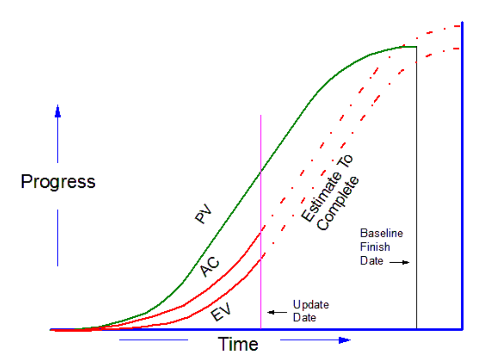

# Indice <!-- omit in toc -->

- **[1. Descrizione dell'Approccio Utilizzato](#1-descrizione-dellapproccio-utilizzato)**
  - [1.1. Elenco documenti](#11-elenco-documenti)
    - [1.1.1. Documentazione delle aziende](#111-documentazione-delle-aziende)
    - [1.1.2. Documentazione del progetto](#112-documentazione-del-progetto)
  
- **[2. Introduzione](#2-introduzione)**
  - [2.1. Azienda esecutrice](#21-azienda-esecutrice)
    - [2.1.1. Startup Team](#211-startup-team)
    - [2.1.2. Politiche aziendali](#212-politiche-aziendali)
      - [2.1.2.1. Orari lavorativi](#2121-orari-lavorativi)
      - [2.1.2.2. Modalità di lavoro](#2122-modalit%c3%a0-di-lavoro)
        - [2.1.2.2.1. Gamification](#21221-gamification)
        - [2.1.2.2.2. Documentazione](#21222-documentazione)
      - [2.1.2.3. Project Meeting](#2123-project-meeting)
        - [2.1.2.3.1. Kick-Off Meeting](#21231-kick-off-meeting)
        - [2.1.2.3.2. Project Scoping Meeting](#21232-project-scoping-meeting)
        - [2.1.2.3.3. Daily Status Meeting](#21233-daily-status-meeting)
        - [2.1.2.3.4. Problem Resolution Meeting](#21234-problem-resolution-meeting)
        - [2.1.2.3.5. Project Review Meeting](#21235-project-review-meeting)
      - [2.1.2.4. Gestione delle comunicazioni](#2124-gestione-delle-comunicazioni)
  - [2.2. Committente](#22-committente)
  - [2.3. Relazione esecutore-committente](#23-relazione-esecutore-committente)

- **[3. Scoping](#3-scoping)**
  - [3.1. Primo contatto](#31-primo-contatto)
  - [3.2. Project Scoping Meeting](#32-project-scoping-meeting)
  - [3.3. Resources Breakdown Structure (RBS)](#33-resources-breakdown-structure-rbs)
    - [3.3.1. Raccolta dei requisiti](#331-raccolta-dei-requisiti)
      - [3.3.1.1. Interviste](#3311-interviste)
      - [3.3.1.2. Osservazioni](#3312-osservazioni)
    - [3.3.2. Costruzione](#332-costruzione)
      - [3.3.2.1. App Android](#3321-app-android)
      - [3.3.2.2. Software Gestione Quadrato](#3322-software-gestione-quadrato)
      - [3.3.2.3. Server](#3323-server)
  - [3.4. Scelta del PMLC Model](#34-scelta-del-pmlc-model)
  - [3.5. Budget e tempi](#35-budget-e-tempi)
  - [3.6. Project Overview Statement (POS)](#36-project-overview-statement-pos)
  - [3.7. Classificazione del progetto](#37-classificazione-del-progetto)
  - [3.8. Scelta del Core Team](#38-scelta-del-core-team)

- **[4. Planning](#4-planning)**
  - [4.1. Joint Project Planning Session](#41-joint-project-planning-session)
    - [4.1.1. Sessione #1](#411-sessione-1)
    - [4.1.2. Sessione #2](#412-sessione-2)
    - [4.1.3. Sessione #3](#413-sessione-3)
  - [4.2. Scelta del PMLC Model](#42-scelta-del-pmlc-model)
  - [4.3. Work Breakdown Structure (WBS)](#43-work-breakdown-structure-wbs)
  - [4.4. Prioritizzazione dei task](#44-prioritizzazione-dei-task)
  - [4.5. Stima delle risorse necessarie](#45-stima-delle-risorse-necessarie)
    - [4.5.1. Valutazione delle skill richieste dai task](#451-valutazione-delle-skill-richieste-dai-task)
    - [4.5.2 Assegnamento membri dello staff ai task](#452-assegnamento-membri-dello-staff-ai-task)
    - [4.6. Stima della durata dei task](#46-stima-della-durata-dei-task)
    - [4.7. Corrispettivo e stima dei costi](#47-corrispettivo-e-stima-dei-costi)
  - [4.8. Project Network Diagram](#48-project-network-diagram)
    - [4.8.1. Scope Bank](#481-scope-bank)
  - [4.9. Analisi dei Rischi](#49-analisi-dei-rischi)
  - [4.10. Project Definition Statement (PDS)](#410-project-definition-statement-pds)
  - [4.11. Piano di qualità](#411-piano-di-qualit%c3%a0)
  - [4.12. Scelta del Developer Team e del Client Team](#412-scelta-del-developer-team-e-del-client-team)

- **[5. Launching / Executing](#5-launching--executing)**
  - [5.1. Scelta del Team](#51-scelta-del-team)
    - [5.1.1. Bilanciamento del team](#511-bilanciamento-del-team)
  - [5.3. Regole operative per il team](#53-regole-operative-per-il-team)
  - [5.4. Assegnamento Risorse e raffinamento della schedula del progetto](#54-assegnamento-risorse-e-raffinamento-della-schedula-del-progetto)
  - [5.5. Assegnamento Responsabilità](#55-assegnamento-responsabilit%c3%a0)
  - [5.6. Gestione delle comunicazioni](#56-gestione-delle-comunicazioni)
  - [5.7. Aggiornamento Project Definition Statement (PDS)](#57-aggiornamento-project-definition-statement-pds)
  - [5.8. Work Packages](#58-work-packages)
  - [5.9. Gestione del processo di modifica dello Scope](#59-gestione-del-processo-di-modifica-dello-scope)

- **[6. Monitoring & Controlling](#6-monitoring--controlling)**
  - [6.1. Rispetto della schedula](#61-rispetto-della-schedula)
  - [6.2. Sistemi di reporting](#62-sistemi-di-reporting)
    - [6.2.1. Tipologie di report utilizzate](#621-tipologie-di-report-utilizzate)
    - [6.2.2. Strumenti di reporting visuale](#622-strumenti-di-reporting-visuale)
    - [6.2.3. Regole per la determinazione della percentuale di completamento](#623-regole-per-la-determinazione-della-percentuale-di-completamento)
  - [6.3. Gestione dello Scope Bank](#63-gestione-dello-scope-bank)
  - [6.4. Issues Log](#64-issues-log)
  - [6.5. Problem Escalation Strategy](#65-problem-escalation-strategy)

- **[7. Chiusura del progetto](#7-chiusura-del-progetto)**
  
- **[8. Bibliografia](#8-bibliografia)**

[//]: # (-------------------------------------------------------------------------)

# 1. Descrizione dell'Approccio Utilizzato
In questo documento sono presentate tutte le scelte effettuate durante la simulazione di progetto, motivandone l'adozione. È pertanto descritto l'approccio di Project Management che si è deciso di applicare sulla base delle conoscenze apprese durante il corso universitario. La descrizione è articolata seguendo il tipico ordine dei gruppi di processo, che si susseguono in termini di picchi di attività. 

Il progetto è stato strutturato in modo tale da permettere una fluida navigazione tra questa guida e i documenti relativi al vero processo di Project Management: in ogni sezione verranno infatti proposti collegamenti agli allegati, ai quali verrà rimandata nelle successive sezioni la dettagliata descrizione di cosa è avvenuto al momento della loro stesura.

La scelta di pubblicare questa simulazione su un repository è dovuta a diversi fattori:
- offre un unico spazio condiviso tra i membri, dove poter collaborare anche a distanza;
- dispone di un sistema di versioning dei file, permettendo di avere un pieno controllo sullo storico delle modifiche apportate ai documenti pubblicati;
- abilita l'utilizzo di collegamenti diretti tra i documenti non solo tramite link url, ma percorsi relativi all'interno dello stesso repository;
- simula perfettamente lo spazio che una fantomatica azienda dovrebbe predisporre per gestire i propri progetti;
- facilita la stesura della documentazione e permette un'immediata esplorazione di essa direttamente dal browser, anche grazie all'utilizzo di MarkDown.

Per la stesura della documentazione si è fatto uso di diversi software:
- **Skype**, per la comunicazione a distanza (ove non era possibile un incontro dal vivo), abilitato anche alla condivisione dello schermo, per un maggiore coinvolgimento;
- **Trello**, per l'organizzazione e il tracciamento del lavoro ([link alla bacheca](https://trello.com/b/dfDeDMvi/pm-project));
- **Visual Studio Code**, per la stesura della documentazione in MarkDown, anche in modalità "Live Sharing" (per permettere la contemporanea stesura del documento da parte di entrambi i membri);
- **Microsoft Project** (in versione di prova), per la costruzione del Project Network Diagram;
- **GitHub Desktop**, per la gestione del repository;
- [**CodeCogs**](https://www.codecogs.com/eqnedit.php), per la generazione di equazioni matematiche in formato *.gif* da inserire all'interno delle tabelle HTML.

## 1.1. Elenco documenti

Per una facile esplorazione del repository, si riporta nel seguente elenco tutta la documentazione significativa realizzata durante la progettazione.

### 1.1.1. Documentazione delle aziende

 - **Documenti fornitore**
   - Startup Team Skills, in formato [testuale](project_docs/startup_team_skills/startup_team_skills.md) e come grafico ([pre skills](project_docs/startup_team_skills/pre_skills_radar_chart.png) e [pro skills](project_docs/startup_team_skills/pro_skills_radar_chart.png));
   - [Project Classification](project_docs/project_classification/project_classification.md) - classificazione dei progetti secondo l'azienda;
   - [Request Acknowledge Template](project_docs/request_acknowledge_template/request_acknowledge_template.md) - documento aziendale inviato al committente per confermare una sua richiesta;
  
- **Documenti committente**
  - [Calendario](project_docs/csen_poomsae_score/project_scoping_meeting/session_18_03_19_res/csen_competitions_dates.pdf) delle competizioni.

### 1.1.2. Documentazione del progetto 
- **Scoping**
  - Project Scoping Meeting
    - 5 sessioni, aventi ognuno un proprio template e cartella risorse
      - 11/03/2019 - introduzione al progetto - ([template](project_docs/csen_poomsae_score/project_scoping_meeting/session_11_03_19.md), [risorse](project_docs/csen_poomsae_score/project_scoping_meeting/session_11_03_19_res));
      - 14/03/2019 - discussione della prima parte (tablet) ([template](project_docs/csen_poomsae_score/project_scoping_meeting/session_14_03_19.md), [risorse](project_docs/csen_poomsae_score/project_scoping_meeting/session_14_03_19_res));
      - 18/03/2019 - discussione della seconda parte (quadrato) ([template](project_docs/csen_poomsae_score/project_scoping_meeting/session_18_03_19.md), [risorse](project_docs/csen_poomsae_score/project_scoping_meeting/session_18_03_19_res));
      - 22/03/2019 - discussione della terza parte (server) ([template](project_docs/csen_poomsae_score/project_scoping_meeting/session_22_03_19.md), [risorse](project_docs/csen_poomsae_score/project_scoping_meeting/session_22_03_19_res));
      - 01/04/2019 - scelta approcio, pos, budget, tempistiche ([template](project_docs/csen_poomsae_score/project_scoping_meeting/session_01_04_19.md));
    - Esempio di [sessione compilata](project_docs/csen_poomsae_score/project_scoping_meeting/session_11_03_19_marcin_pabich.md) da Marcin Pabich, del 11/03/2019;
    - [Descrizione del progetto](project_docs/csen_poomsae_score/project_scoping_meeting/project_description.md);

  - Resources Breakdown Structure (RBS)
    - Esempio di [intervista](project_docs/csen_poomsae_score/rbs/interview_26_03_19.md);
    - RBS in formato [Visual Paradigm (.vpp)](project_docs/csen_poomsae_score/rbs/rbs.vpp) e come [immagine](project_docs/csen_poomsae_score/rbs/rbs.png);

  - [Project Overview Statement (POS)](project_docs/csen_poomsae_score/pos/pos.md);

- **Planning**
  - Joint Project Planning Session
    -  08/04/2019 - [agenda sessione 1](project_docs/csen_poomsae_score/joint_project_planning_session/session_08_04_19.md);
    - 09/04/2019 - [agenda sessione 2](project_docs/csen_poomsae_score/joint_project_planning_session/session_09_04_19.md);
    - 10/04/2019 - [agenda sessione 3](project_docs/csen_poomsae_score/joint_project_planning_session/session_10_04_19.md);
  
  - Work Breakdown Structure (WBS)
    - WBS iniziale, in formato [Visual Paradigm (.vpp)](project_docs/csen_poomsae_score/wbs/wbs.vpp) e come  [immagine](project_docs/csen_poomsae_score/wbs/wbs.png);
    - WBS definitiva, in formato [Visual Paradigm (.vpp)](project_docs/csen_poomsae_score/wbs/final_wbs.vpp) e come [immagine](project_docs/csen_poomsae_score/wbs/final_wbs.png);
    - [File integrativo](project_docs/csen_poomsae_score/wbs/final_wbs.md) contenenti le descrizioni delle singole attività;

  - [Task Prioritizations](project_docs/csen_poomsae_score/wbs/task_prioritizations.md) - assegnazione delle priorità ai task;

  - Stime delle risorse e del tempo
    - [Need inventory](project_docs/csen_poomsae_score/staff_skills_assignments/needs_inventory.md);
    - [Skills inventory](project_docs/startup_team_skills/startup_team_skills.md);
    - [Staff assignment](project_docs/csen_poomsae_score/staff_skills_assignments/staff_assignment.md);
    - [Stime durata dei task](project_docs/csen_poomsae_score/task_duration_estimation/task_duration_estimation.md);
  
  - [Project Network Diagram](project_docs/csen_poomsae_score/project_network_diagram/)
    - PND [non ottimizzato](project_docs/csen_poomsae_score/project_network_diagram/pnd_not_optimized.mpp) e [ottimizzato](project_docs/csen_poomsae_score/project_network_diagram/pnd_optimized.mpp), in formato Microsoft Project;
    - Gantt [non ottimizzato](project_docs/csen_poomsae_score/project_network_diagram/gantt_not_optimized.gif) e [ottimizzato](project_docs/csen_poomsae_score/project_network_diagram/gantt_optimized.gif), in formato immagine;
    - Critical Path [non ottimizzato](project_docs/csen_poomsae_score/project_network_diagram/critical_path_not_optimized.gif) e [ottimizzato](project_docs/csen_poomsae_score/project_network_diagram/critical_path_optimized.gif), in formato immagine;
  
  - Rischi
    - [Analisi dei rischi](project_docs/csen_poomsae_score/risk_management/risk_identification_assessment.md);
    - [Risk Matrix](project_docs/csen_poomsae_score/risk_management/qualitative_risk_assessment.md);
    - [Risk Mitigation Planning](project_docs/csen_poomsae_score/risk_management/risk_mitigation_planning.md);
  
  - [Project Definition Statement (PDS)](project_docs/csen_poomsae_score/pds/pds.md);

  - [Quality Plan](project_docs/csen_poomsae_score/quality_plan/quality_plan.md);
    - Esempio di un [sondaggio](project_docs/csen_poomsae_score/quality_plan/ux_evaluation_16_08_19_mario_rossi.md) effettuato per valutare la User Experience;

- **Launching / Executing**
  - [Problem Solving Template](project_docs/csen_poomsae_score/operating_rules/problem_solving_template.md)
  
  - [Decision Making Template](project_docs/csen_poomsae_score/operating_rules/decision_making_template.md)
  
  - Scope Change Request
    - [Form di richiesta](project_docs/csen_poomsae_score/scope_change_request/scope_change_request_form.md)
    - [Processo di approvazione](project_docs/csen_poomsae_score/scope_change_request/scope_change_request_process.png) 
    - [Project Impact Statement](project_docs/csen_poomsae_score/scope_change_request/project_impact_statement.md)
  
- **Monitoraggio e controllo**
  - [Issues Log](project_docs/csen_poomsae_score/issues_log/issues_log.md)

[//]: # (-------------------------------------------------------------------------)

# 2. Introduzione
In questa sezione sono fornite informazioni di carattere generale relative all'esecutore e al committente. Viene analizzato il rapporto tra queste due entità, con lo scopo di fornire una larga veduta sull'intera struttura su cui il progetto si basa e di comprendere le ragioni che hanno portato a intraprendere determinate scelte a discapito di altre. Si illustrano inoltre le competenze dei singoli membri facenti parte del team dell'azienda fornitrice, scendendo anche nel dettaglio delle politiche aziendali.

## 2.1. Azienda esecutrice
L'esecutore del progetto è la startup "**PunchCode**". Essa è un'azienda informatica specializzata nella costruzione di soluzioni software, composta da due soli dipendenti neo-laureati. Essendosi appena costituita, non presenta esperienza pregressa in altri progetti e conseguentemente non possiede un know-how in alcuna area di mercato. Considerando l'esiguo numero di persone interne all'azienda, quest'ultima non è al momento decomposta in specifiche aree funzionali sul piano organizzativo; tuttavia è in espansione e prevede l'acqusizione nel breve termine di nuovo personale con competenze tecniche specializzate. Il principale motivo per cui l'azienda è stata scelta dal committente, oltre ad aver presentato un'offerta più aggressiva rispetto ai principali concorrenti, è da ricercarsi nella sua propensione all'uso di tecnologie innovative che l'hanno portata ad acquisire un'indubbia fama sul territorio e a ottenere un alto livello di attenzione sul panorama mediatico per mezzo dell'incubatore nel quale è localizzata.

### 2.1.1. Startup Team

PunchCode è formata da due soli membri ricoprenti entrambi il ruolo di Project Manager. Le competenze di ogni dipendente sono tracciate dall'azienda all'interno di un apposito [documento](project_docs/startup_team_skills/startup_team_skills.md), tenendo conto sia di *pre skill* (o soft skill) che di *pro skill* (o hard skill). Le prime si riferiscono alle capacità inerenti alla sfera interpersonale e della comunicazione, indipendenti dalla specifica mansione lavorativa e pertanto trasversali. Le seconde sono quelle competenze tecniche relative allo svolgimento di una certa professione, acquisibili tramite lo studio e certificabili. Nell'ottica di andare a delineare un valido strumento di appoggio per un Project Manager ai fini della futura assegnazione delle attività ai membri dello staff in fase di Planning, si è infatti ritenuto utile includere la valutazione di ambo le tipologie di abilità. Per quanto concerne l'assegnazione dei punteggi, si è voluta considerare una scala di valori numerici adimensionali compresa tra 1 e 5 (preferendola ad alternative misure non numeriche che avrebbero impedito la valutazione delle competenze in media di tutto il team su un certo parametro). Si nota come tali punteggi siano stati delineati dai due membri del team attraverso una media tra i risultati di un processo di autovalutazione e quelli di una sincera valutazione operata da parte del collega (sulla base anche della profonda conoscenza reciproca maturata nel susseguirsi degli anni). Si osserva tuttavia come PunchCode preveda di definire tali dati per il personale futuro attraverso lo svolgimento di test (poi mantenuti aggiornati dai Project Manager in funzione delle loro abilità manifestate sul campo, nel corso dei vari progetti). 

Il team è consapevole dell'assenza di una figura interna rivestente il ruolo di Architetto. Per consentire comunque l'instaurazione di dibattiti costruttivi si è scelto - in base alle pre-skill e alle pro-skill - di far sì che un membro difendesse gli interessi legati al ruolo di un architetto (impersonandolo).
Sotto questo punto di vista, è Marcin Pabich (specie grazie alle sue maggiori capacità creative) ad occuparsi anche di questo aspetto.

### 2.1.2. Politiche aziendali

Per far fronte ipoteticamente a più progetti in parallelo, l'azienda decide di adottare delle buone pratiche di natura generale al fine di uniformare alcuni degli aspetti più critici della gestione dei gruppi di processo (lasciando comunque spazio a eventuali personalizzazioni dettate dalle esigenze di specifici progetti, qualora si dovessero rivelare necessari).
Si sottolinea come tali politiche aziendali possano subire modifiche a fronte della review operata al termine di ogni progetto, nell'intento di un continuo processo di miglioramento. Un ulteriore motivo di cambiamento potrebbe essere anche la futura evoluzione dell'organizzazione aziendale a causa del maggior numero di dipendenti e di una migliore suddivisione delle responsabilità.

#### 2.1.2.1. Orari lavorativi
La startup segue un comune modello di suddivisione delle giornate e dell'orario lavorativo, cosiderando la produzione attiva dal lunedì al venerdì, dalle ore 09:00 alle ore 18:00, con una pausa pranzo intermedia nella fascia 12:00-13:00. La disponibilità del team permette di essere comunque molto flessibili, consentendo eventuali modifiche agli orari e/o giornate lavorative (assecondando eventualmente le esigenze del committente).

#### 2.1.2.2. Modalità di lavoro
L'azienda consente lo svolgimento del lavoro in forma telematica direttamente da casa, ad eccezzione dei Project Meeting di diversa natura, come discusso in dettaglio nella [prossima sezione](#2123-project-meeting). Inoltre, per la risoluzione dei problemi complessi e per un maggiore coinvolgimento dei dipendenti, il team di sviluppo può avvalersi anche di tecniche di lavoro denominate *Pair Programming*, sia in remoto che in loco; quest'ultime possono essere utilizzate sia in fase di coding, che nella stesura della documentazione. Esse infatti stimolano utili brainstorming e danno la possibilità al management e agli sviluppatori di capire dove siano stati apportati eventuali cambiamenti di rotta e quali questi siano.

##### 2.1.2.2.1. Gamification
Al fine di motivare gli impiegati e rendere le loro attività quotidiane meno frustranti nella loro percezione, PunchCode si avvale di tecniche di Gamification all'interno dei propri progetti di sviluppo software. Questa scelta è frutto di approfondite [ricerche in letteratura](#bibliography-1)1, 2 che testimoniano come esse influenzino positivamente i risultati di un gruppo di lavoro.  
PunchCode - sotto questo punto di vista - si avvale di un proprio sistema di login per il tracciamento delle attività compiute dai dipendenti, premiandoli con dei *punti* (come componente di gioco) in caso di:
- lettura di codice / documentazione di colleghi con invio di feedback in forma di rating compreso nel range 1 (pessimo) - 5 (ottimo);
- ricezione di feedback positivi da parte di un collega.

L'uso di una metodologia di questo tipo porta a diversi vantaggi:
- stimola i dipendenti a revisionare il lavoro realizzato dagli altri;
- abilita una forma di trasferimento di conoscenza a partire da esempi positivi forniti dai colleghi.

##### 2.1.2.2.2. Documentazione

- **Sviluppo**  
PunchCode riversa sulla documentazione un ruolo di primaria importanza per numerose ragioni (tra cui riusabilità, manutenibilità, condivisione e storico sia in termini di problematiche che di soluzioni).
Rientra pertanto nelle politiche aziendali la volontà di dedicarsi alla scrittura di quest'ultima non a progetto finito, ma costantemente nel corso della sua evoluzione. L'overhead legato all'operazione di aggiornamento continuo è così giustificato dall'obiettivo di minimizzare il senso di frustrazione in fase di stesura (partizionando il carico di lavoro complessivo) e di voler risparmiare tempo in futuro.  
Lo svolgimento della documentazione tecnica in parallelo con lo sviluppo del codice è ritenuto centrale da parte di PunchCode. Essa viene autogenerata per mezzo di appositi tool.

- **Mantenimento**  
L'azienda utilizza un repository online come **workbook** per conservare l'insieme della documentazione relativa ai vari progetti, anche a fini legali. Per consentire un facile reperimento delle informazioni, i file vengono suddivisi in directory in base alla loro tipologia e al progetto di appartenenza.

- **Copertura**  
La startup si avvale di strumenti atti a misurare la percentuale di copertura (*coverage*) del codice da parte dei test. È volontà dell'azienda mantenere un risultato >=70% all'interno di tutte le applicazioni realizzate da essa.

#### 2.1.2.3. Project Meeting

L'azienda applica dei template specifici per le tipologie di incontri. Ciascuno di questi richiede - a fini storici - la specifica della data, dei partecipanti e dell'oggetto. La costruzione di un'agenda prima di una riunione è ritenuta un'operazione obbligatoria per PunchCode. Le eventuali note / esiti (es. decisioni prese / richiesta di ulteriori approfondimenti) associate ai vari punti sono registrate all'interno di un apposito campo previsto dal documento.

##### 2.1.2.3.1. Kick-Off Meeting

Il Project Kick-Off Meeting riveste un ruolo centrale e provvede ad annunciare che il progetto pianificato è stato approvato per la fase esecutiva. PunchCode prevede un solo incontro per la sua risoluzione.
Per l'agenda, l'azienda adotta la seguente struttura:
- introduzione;
- presentazione dello sponsor al team di progetto;
- presentazione degli aspetti rilevanti del progetto da parte dello sponsor;
- presentazione del progetto (committente);
- presentazione del progetto (project manager);
- presentazione dei membri del team di progetto;
- analisi del PDS ed eventuale apporto di integrazioni. 

In questa occasione, si stabiliscono le regole operative del team, si integrano nella schedula le disponibilità dei membri del team e si identificano i Work Packages (insiemi di attività facili da monitorare e controllare, con uno specifico significato).

##### 2.1.2.3.2. Project Scoping Meeting

Al fine di entrare in contatto col cliente e iniziare a delineare lo scope del progetto, l'azienda prevede un Project Scoping Meeting organizzato come di seguito descritto.
Sul piano dello schema, l'obiettivo delle varie riunioni che compongono tale processo consiste nella produzione dei seguenti deliverable:
- Conditions of Satisfaction (CoS), con match tra richieste del committente e reali esigenze;
- Requirements Breakdown Structure (RBS);
- PMLC Model;
- Project Overview Statement (POS).

L'elenco dei partecipanti prevede la presenza delle seguenti figure.
- Lo *staff aziendale* col ruolo di Project Manager.
- Il *Client Group* (con l'eventuale presenza sollecitata di personale legato ad aree funzionali o ad attività in discussione con l'agenda odierna). Come per il gruppo di lavoro dell'esecutore, anche quello del committente è già stato definito antecedentemente allo scoping.

Non disponendo delle risorse necessarie, i ruoli di *Facilitatore* e *Tecnografo* sono temporaneamente ricoperti dai membri del team aziendale che cercheranno conseguentemente di dare valore al tempo, evitare discussioni inutili, convergere su tutti gli argomenti in agenda, raccogliere le informazioni in forma documentale (verbale) e strutturarle in modo tale da facilitare il loro reperimento. L'azienda prevede tuttavia di integrare un *Facilitatore* non appena ne avrà le possibilità, poichè - nonostante i maggiori costi che ne deriveranno - la figura di un mediatore imparziale tra le parti è da considerarsi centrale e potrebbe costituire un valore aggiunto significativo, anche nell'intento di evitare problematiche dovute a fraintendimenti e tensioni tra chi gestirà e svilupperà il progetto e il committente.

Dal momento che il Project Scoping Meeting può comprendere numerose sessioni in giornate diverse, l'azienda preferisce intraprendere una sola riunione di partenza, valutandone eventualmente altre in base alle necessità. Tra due sessioni è richiesto un intervallo di tempo pari a una settimana, al fine di analizzare e organizzare le informazioni raccolte, oltre che preparare la prossima agenda. In ogni caso, una sessione si conclude sempre con la definizione dei punti che occorrerà discutere durante la successiva.

L'azienda è anche interessata a fare una breve review al termine di ogni sessione di Project Scoping Meeting per valutare il rispetto dell'agenta, il livello di partecipazione e altri parametri utili per un miglioramento continuo.

##### 2.1.2.3.3. Daily Status Meeting

L'azienda prevede la presenza di riunioni giornaliere per mantenere monitorato lo stato di avanzamento dei task. Nello specifico adotta la forma di Stand-up Meeting, preferendola ad alternative come resoconti di fine giornata.

Tali incontri avvengono alle ore 09:00 del mattino e hanno una durata massima di 20 minuti, nei quali si riporta sinteticamente lo stato di ciascuna attività e ci si concentra sugli aspetti maggiormenti critici.
In queste occasioni, si associa inoltre a ogni task un colore in linea col Spotlight Report allo scopo di creare un comodo strumento visuale capace di offrire in breve tempo una panoramica sull'andamento di un certo progetto. L'azienda consiglia inoltre ai dipendenti di valutare sempre se sia il caso di considerare una riunione specifica a fronte della presenza di task fuori controllo (etichettati come rossi).

Lo svolgimento degli Stand-Up Meeting dovrebbe sempre avvenire dal vivo, anche se, in via del tutto eccezzionale, è possibile svolgerlo in via telematica: in questo caso, però, è strettamente necessario l'utilizzo di una WebCam per un rapporto semi-diretto con gli interlocutori (che secondo degli studi sociologici favorirebbe lo sviluppo della discussione). Data la natura informale degli incontri, è preferibile parteciparvi "*in piedi*" per stimolare una maggior attenzione e minimizzare la durante del meeting stesso.

##### 2.1.2.3.4. Problem Resolution Meeting

PunchCode considera lo svolgimento di Problem Resolution Meeting per la discussione di problematiche riscontrate durante lo svolgimento di un progetto. L'azienda prevede nello specifico che questi siano organizzati qualora si ritengano necessari a fronte dell'individuazione di attività fuori controllo durante uno Stand-up Meeting. In queste riunioni per la risoluzione di un problema l'agenda deve prevedere:
- la partecipazione dei soli sviluppatori coinvolti nel problema;
- la determinazione del/i proprietario/i (owner) del problema (potenzialmente molteplici da punti di vista diversi);
- l'identificazione della soluzione;
- la determinazione delle modalità (come e quando) attraverso cui stabilire che il problema è da considerarsi risolto.

Preme tuttavia sottolineare come - a causa del ridotto personale attualmente presente nella startup - tali meeting richiedano necessariamente la presenza di entrambi i membri.

##### 2.1.2.3.5. Project Review Meeting

In concomitanza col raggiungimento di una milestone, l'azienda svolge un Project Review Meeting. Durante questi eventi formali:
- si svolge la presentazione dello stato del progetto in corrispondenza della milestone e si effettua una sua revisione critica;
- partecipano il project manager, il senior management, lo sponsor, il committente, gli stakeholder e 2-3 tecnici esperti dell'ambito di progetto della milestone. PunchCode richiede pertanto obbligatoriamente la presenza del cliente in questi incontri (ove non sia possibile, è sufficiente un suo referente);
- si presentano le performance fornite dal progetto fino a quel momento;
- si identificano eventuali problemi e si propongono anche azioni correttive.

Come già evidenziato, le attuali ridotte dimensioni della startup potrebbero avere un impatto sulle figure partecipanti.

#### 2.1.2.4. Gestione delle comunicazioni

- L'accettazione di ogni informazione da parte del destinatario (cliente o figura aziendale) avviene esclusivamente per mezzo di feedback scritto in formato elettronico. Il cliente interagisce direttamente col/i Project Manager dell'azienda e a fronte di ogni comunicazione (anche di tipo one-to-one) viene redatto un documento riassuntivo, seguendo uno specifico [template](project_docs/request_acknowledge_template/request_acknowledge_template.md). Questo viene successivamente inviato al richiedente, il quale dovrà rispondere per iscritto confermando o rifiutando il contenuto. In questo modo si cercano di evitare pericolosi scenari che potrebbero essere dettati dalla presenza di una regola di silenzio assenso, da fenomeni di incomprensione o da rinnegamenti. Solo al sopraggiungere della conferma, il documento riassuntivo viene inserito nel workbook e - qualora si tratti di un interrogativo o di una richiesta - preso in carico da parte del Project Manager (scatenando eventualmente ulteriori processi basati su documenti con altri template specifici, come il Project Impact Statement per le richieste di cambiamento di scoping - ad esempio). L'azienda considera pertanto richieste solo all'ottenimento del feedback loro associato.  
Per quanto concerne le comunicazioni interne all'azienda, queste vengono formalizzate solo se rilevanti per il progetto o di interesse (per altri dipendenti, come storico per miglioramento della gestione interna o per progetti futuri) utilizzando lo stesso template. L'azienda tuttavia sollecita i dipendenti a esprimere le proprie idee / osservazioni durante gli Stand-up Meeting approfittando della presenza di tutti gli interessati.

- A fronte di ogni Stand-up Meeting, viene redatta una documentazione scritta soltanto per le attività cui è stata assegnata una colorazione gialla o rossa attraverso lo Spotlight Report da parte del responsabile dello specifico task (concentrandosi sulle sole attività oggetto di scostamenti dal piano o rappresentanti scenari fuori controllo), raccogliendo informazioni motivazionali utili ed evitando di investire tempo nella produzione di comunicazioni scritte per le attività in schedula (verdi). Terminato l'incontro, il documento viene caricato nel repository dell'azienda.

## 2.2. Committente
Il committente è CSEN (Centro Sportivo Educativo Nazionale), un ente di elevate dimensioni operante su tutto il territorio nazionale senza finalità di lucro e avente come obiettivo principale quello di perseguire una propaganda sportiva di alto valore sociale. CSEN contribuisce pertanto allo sviluppo della pratica sportiva e a una sua miglior accessibiltà da parte delle persone, creando le condizioni per una più larga crescita dell'educazione fisica, dello sport stesso e della salute. Collabora inoltre con il C.O.N.I. e le Federazioni Sportive, con la Scuola, con le Regioni e gli Enti Locali, con le forze sociali e politiche e con le libere associazioni di altri Paesi.
Esso è organizzato come segue:
- 1.650.000 Soci Dirigenti, Tecnici, Atleti, Amatori;
- 15.540 Associazioni Sportive A.S.D. / S.S.D.;
- 4.300 Associazioni Sportive (Basi Associative Sportive);
- 2.000 Associazioni Promozione Sociale e Tempo Libero;
- 1.300.000 Tesserati Sportivi;
- 500.000 Tesserati del Tempo Libero;
- 20 Comitati Regionali;
- 106 Comitati Provinciali;
- 25 Comitati di Zona.

Il progetto è stato assegnato da Enrico Comando (nome di fantasia), che ne ricopre anche il ruolo di Project Manager. Enrico Comando è stato scelto poichè qualificato sia in termini di competenze informatiche che di dominio, oltre che dotato di una profonda esperienza nella coordinazione di ulteriori progetti per conto di CSEN - comunque legati a quello che verrà successivamente esposto.

## 2.3. Relazione esecutore-committente
Il committente è alla ricerca di un fornitore innovativo e giovane, puntando sulle startup locali emergenti. Le due parti non si conoscono e non hanno mai collaborato a nessun progetto, ma grazie alla crescente notorietà nel campo di programmazione di PunchCode, essa è stata presa in considerazione sin da subito come un potenziale appaltatore.

[//]: # (-------------------------------------------------------------------------)

# 3. Scoping
In questa sezione sono riportate tutte le scelte intraprese durante la fase di scoping. Dopo una sintetica spiegazione sul come sia avvenuto il primo contatto, gli argomenti sono proposti in base ai deliverable coinvolti da questo gruppo di processo. Inoltre, è anche discussa l'organizzazione dei meeting (documentando l'ordine del giorno, i partecipanti e una sintesi dell'ipotetico svolgimento).

## 3.1. Primo contatto
Il primo contatto tra il committente e l'esecutore avviene utilizzando la mail aziendale. Il committente, dopo una breve presentazione di CSEN, esprime subito la sua volontà di informatizzare il processo di gestione delle gare di Taekwondo organizzate da CSEN, senza adottare in questa sua richiesta una descrizione di dettaglio. La startup, seguendo le buone pratiche descritte in precedenza, decide di proporre al committente un Project Scoping Meeting, al fine di chiarire tutte le ambiguità e valutare la fattibilità della proposta. In base alla disponibilità del cliente viene stabilito che l'incontro si svolgerà il lunedì 11 marzo, alle ore 09:00, all'interno della sala riunioni di PunchCode. A rappresentare l'azienda cliente vi sarà il relativo Project Manager: Enrico Comando.

## 3.2. Project Scoping Meeting

Il Project Scoping Meeting costituisce la prima occasione d'incontro tra il fornitore e il committente. Applicando le politiche aziendali, si è svolta una prima sessione seguendo l'agenda disponibile nel relativo [allegato](project_docs/csen_poomsae_score/project_scoping_meeting/session_11_03_19.md).
Tale file è distribuito a tutte le figure aziendali presenti alla riunione e - come è possibile dedurre dal suo contenuto - prevede degli appositi campi "note" compilabili digitalmente al fine di tener traccia delle varie osservazioni emerse in ogni fase di cui il meeting è composto. Prevede inoltre una sezione dedicata alla valutazione dell'incontro e alla pianificazione del successivo.
Nella costruzione dell'agenda descritta nel documento in oggetto si sono effettuate le seguenti considerazioni.
- Non disponendo al momento di un Facilitatore, tale ruolo è ricoperto dal Project Manager aziendale con le soft skill più idonee ai suoi compiti (quali organizzazione, comunicazione ed empatia). Tenendo inoltre conto di come Marcin Pabich sia anche incaricato di riflettere gli interessi di un Architetto (interessandosi più della bellezza della soluzione che del costo a essa associata), si è ritenuto che Giacomo Frisoni fosse il membro più idoneo.
- I tempi relativamente le durate di ogni argomento in agenda sono stimati a partire dal contenuto della mail di contatto pervenuta da CSEN, ricordando tuttavia l'alta probabilità di discostamento a causa della non esperienza di PunchCode.
- Dal momento che la discussione delle **Condition of Satisfaction** (CoS) non viene fatta in un unico punto, si è scelto di prevedere un'apposita area all'interno del template del documento in cui annotare man mano gli obiettivi del progetto. *Non essendoci, inoltre, una definizione condivisa di CoS (come sfortunatamente spesso accade in ambiti di Project Management), PunchCode ha maturato una propria opinione personale in merito (consistente con gli altri elementi del processo di gestione). Per l'azienda, i CoS rappresentano un documento esprimente le **condizioni alla base del progetto**, elencante tutti quei requisiti che il fornitore necessita di rispettare per far sì che il cliente riceva esattamente quanto voluto (incontrando le sue aspettative). A tal proposito, infatti, viene approvato da tutti gli stakeholder. I Project Manager della startup concordano con Wysocki nel considerare i CoS come un processo da svolgere nella fase di Scoping, i cui punti non coincidono né con i goal, né con gli obiettivi né con i criteri di successo (ma che contribuiscono a renderli più chiari). Alcune delle condizioni in oggetto si riferiscono effettivamente a degli obiettivi, mentre altre riguardano altri aspetti (quali risorse disponibili, requirement strategici dell'azienda ecc.).*
- Dato che il cliente può fornire materiale di varia natura all'interno di un meeting, si predispone anche un'apposita sezione in cui tener traccia dei riferimenti a quanto fornito.
- La compilazione digitale del documento è stata scelta per diverse ragioni:
  - facilita un eventuale processamento automatico delle informazioni in esso contenute;
  - velocizza il processo di annotazione (anche considerando come un membro dello staff aziendale sia frequentemente impegnato nel dirigire la discussione)
  - rende il contenuto del documento maggiormente fruibile da parte di tutti gli interessati.

Un esempio di documento compilato per quanto concerne la prima sessione è disponibile nel seguente [allegato](project_docs/csen_poomsae_score/project_scoping_meeting/session_11_03_19_marcin_pabich.md).

A causa della complessità del progetto, durante il primo incontro si è subito manifestata la necessità di pianificarne altri. Nello specifico, riconoscendo la presenza di vari sottosistemi, si è pertanto preferito organizzare un meeting per entrare nei dettagli di ciascuno di questi (sollecitando di volta in volta la partecipazione delle figure coinvolte lato committente da parte di quel sottosistema) e limitarsi con la prima riunione a inquadrare il problema solo in termini generali. Tenendo conto di come il cliente abbia manifestato fin da subito la sua disponibilità a più incontri nell'arco di una settimana, l'elenco delle successive sessioni svolte è di seguito riportato (specificando per ognuna data e agenda):

 - 14/03/2019 - [agenda per il sottosistema dedicato ai tablet dei giudici](project_docs/csen_poomsae_score/project_scoping_meeting/session_14_03_19.md)  
 - 18/03/2019 - [agenda per il sottosistema dedicato al software per la gestione di un quadrato di gara](project_docs/csen_poomsae_score/project_scoping_meeting/session_18_03_19.md)  
 - 22/03/2019 - [agenda per il sottosistema dedicato alla gestione di un torneo lato server](project_docs/csen_poomsae_score/project_scoping_meeting/session_22_03_19.md)  

Nell'intervallo di tempo compreso tra una sessione e la successiva, PunchCode si impegna anche alla realizzazione di mockup (sottoposti al giudizio del committente tramite email), sia per quanto riguarda [l'applicazione Android](project_docs/csen_poomsae_score/project_scoping_meeting/session_14_03_19_res/mockup) in esecuzione sui tablet dei giudici, sia per i [software di gestione del quadrato di gara](project_docs/csen_poomsae_score/project_scoping_meeting/session_18_03_19_res/mockup) per i computer in dotazione.

Dopo aver discusso nel dettaglio di ogni sottosistema (comprendendo problematiche, desiderata e modalità di raccolta dei requisiti), si è infine pianificato un ultimo meeting (successivo all'applicazione delle tecniche finalizzate alla raccolta dei requisiti, alla classificazione del progetto e all'identificazione dei rischi) per la scelta del PMLC Model (descritta nella [prossima sezione](#34-scelta-del-pmlc-model)) che meglio si adattasse alla chiusura del gap individuato (tenendo chiaramente conto anche della disponibilità del cliente). In questa occasione si è anche effettuata la stesura di una bozza del POS (con relativa approvazione):

 - 01/04/2019 - [agenda del meeting conclusivo per la definizione dello scope](project_docs/csen_poomsae_score/project_scoping_meeting/session_01_04_19.md)

Per quanto concerne il budget e la durata del progetto, si è prevista una discussione iniziale di questi aspetti - condotta da parte del Project Manager del cliente - già all'interno della prima sessione (in modo tale da non considerare nemmeno la pianificazione delle riunioni successive in assenza delle condizioni per farlo). Si osserva inoltre come si sia organizzata un'ulteriore e analoga discussione di questi temi all'interno dell'ultima sessione, condotta però da parte del Project Manager dell'azienda (ora consapevole di tutti i dettagli del progetto e in grado di fare una reale valutazione dal suo punto di vista).

Si osserva anche come, durante l'ultimo incontro, Enrico Comando abbia manifestato la sua disponibilità a prendersi carico della formazione dei vari utilizzatori dei sottosistemi (richiedendo pertanto a PunchCode una sua sola formazione, agevolata da un suo frequente coinvolgimento e dalla sua già previa esperienza con progetti di natura informatica).

Unendo tutte le informazioni raccolte sui bisogni del cliente, il documento di descrizione dell'intero progetto è disponibile al seguente [allegato](project_docs/csen_poomsae_score/project_scoping_meeting/project_description.md).

## 3.3. Resources Breakdown Structure (RBS)

### 3.3.1. Raccolta dei requisiti

In ogni Project Scoping Meeting dedicato a uno specifico sottosistema, si sono discusse e definite le modalità di acquisizione dei relativi requisiti (con approcci ulteriori alla singola riunione). Dopo un'attenta analisi, considerando la disponibilità manifestata dal cliente, si è deciso di optare per **Interviste** e **Osservazioni**. Altri metodi, come il "Requirements Reuse" e il "Prototyping" non sono stati adottati dal momento che non si verificano le condizioni necessarie alla loro attuazione (l'azienda non ha esperienza su progetti precedenti da cui riprendere parte di implementazione e la realizzazione di un prototipo si rivela eccessivamente costosa e rischiosa).

#### 3.3.1.1. Interviste
Al fine di avere una descrizione dei processi e delle problematiche attuali direttamente da chi li gestisce, si è ritenuto opportuno prevedere *tre interviste*: due per gli addetti responsabili alle gestione dei quadrati e una per il gestore del server.

Essendo PunchCode formata da due soli membri, per compensare l'assenza di un analista interno all'azienda, viene presa la decisione di far rivestire il ruolo di intervistatore a entrambi i membri (formulando e sottoponendo le domande agli intervistati in coppia). Questa scelta va anche nella direzione di ridurre il rischio di un'interpretazione errata delle risposte, nonostante si sia consapevoli che un simile approcio potrebbe scoraggiare l'intervistato ad esprimersi in piena libertà.

Un ulteriore motivo che ha portato alla scelta di questo metodo è da ricercarsi nel fatto che l'esecutore non ha mai condotto progetti antecedenti simili a quello in esame. Di conseguenza potrebbe per lui risultare difficile dedurre ciò di cui il committente ha bisogno solamente attraverso le discussioni svolte durante i meeting.

L'intervistato potrebbe distorcere la realtà, avere difficoltà a esprimersi o, in preda ad agitazione, fornire informazioni poco precise.
Una possibile soluzione a questo problema consiste normalmente nell'adozione di un approccio deduttivo, chiamato "ad imbuto".
L'intervistatore parte da domande molto generali per poi restringere l'argomento dell'intervista a temi specifici. Il carattere generale dei quesiti iniziali (normalmente in forma aperta), infatti, allieva la tensione dell'intervistato (che potrebbe altrimenti essere emozionato o eccessivamente deferente).

Per la definizione delle domande legate a ogni intervista, inoltre, si è ritenuto fondamentale tener conto della posizione ricoperta e delle mansioni svolte dell'intervistato (ricercando sempre un focus preciso).

Un esempio di intervista realizzata da PunchCode al gestore del sistema software dedicato ai quadrati di gara è disponibile al seguente [allegato](project_docs/csen_poomsae_score/rbs/interview_26_03_19.md).

#### 3.3.1.2. Osservazioni
Per risolvere ulteriormente i tipici problemi di un'intervista, si è scelto di integrare quest'ultima con un'osservazione. Questo ulteriore approccio è molto educativo e permette di comprendere al meglio il modo di lavorare del cliente, dimostrandosi di conseguenza utile per rilevare requisiti del sistema che altrimenti rischierebbero di non emergere da domande.  

Grazie agli accordi presi durante i meeting, i membri di PunchCode hanno così potuto partecipare direttamente a una delle gare svolte dallo CSEN.

### 3.3.2. Costruzione
Al fine di esprimere all'utente in maniera chiara, intuitiva e significativa i requsiti raccolti, si è scelto di costruire un RBS, in linea con le buone pratiche del PMBOK proposto da PMI. Nel far ciò, si è prestata attenzione nel non definire attività con una granularità troppo fine (che avrebbe altrimenti portato ad alti costi in fase di monitoraggio e controllo).   

Nella stestura dell'[RBS](project_docs/csen_poomsae_score/rbs/rbs.png), PunchCode ha ritenuto opportuno affrontare la decomposizione gerarchica dei requisiti tenendo conto di tre macro-aree (rappresentanti i tre principali sottosistemi del progetto).

#### 3.3.2.1. App Android
È il sottosistema incentrato sullo sviluppo dell'applicazione Android per la registrazione dei punteggi associati alle poomsae da parte dei giudici.

- *Registrazione Punteggio*  
  Deve essere possibile registrare il punteggio per una determinata poomsae, attraverso step successivi e tenendo conto di parametri diversi.
  
- *Invio Punteggio*  
  Il punteggio calcolato dal giudice necessita - qualora ci si trovi in modalità online - di essere inviato al software per la gestione del quadrato di gara. 

- *Storico*  
  Si deve mantenere traccia di tutti i punteggi registrati attraverso l'uso dell'applicazione.

- *Impostazioni*  
  L'applicazione deve prevedere un'area dedicata al settaggio di impostazioni di utilità.

#### 3.3.2.2. Software Gestione Quadrato
È il sottosistema incentrato sullo sviluppo della soluzione software atta a gestire i tornei all'interno di un quadrato.

- *Ricezione Tornei*  
  Ogni quadrato, all'inizio di una competizione, riceve una serie di tornei da gestire (sulla base della decomposizione realizzata dal server).

- *Selezione Torneo*  
  Prima di procedere alla selezione degli alteti, è necessario selezionare il torneo dal quale sceglierli.

- *Gestione Torneo*  
  Prevede la gestione delle singole poomsae nelle diverse **gare** e il mantenimento in forma permanente dei dati acquisiti (**salvataggio**).

- *Visualizzazione*
  I dati acquisiti dai quadrati devono essere visualizzati al pubblico su appositi monitor.

#### 3.3.2.3. Server  
È il sottosistema software rappresentante la parte centrale nella gestione di competizioni. Esso consente di crearle e configurarle, oltre che gestirle una volta inizializzate.

- *Configurazione Competizione*  
  Prima di essere operativa, la competizione dev'essere opportunamente *configurata*. La configurazione avviene attraverso due macro-fasi:
  
  - *Creazione*, stabilendo i parametri generici (anagrafica) della competizione stessa e importando i dati degli atleti dall'apposito file;
  
  - *Aggiornamento*, consentendo la *manipolazione dei tornei* interni alla competizione nei momenti antecedenti alla sua inizializzazione e il *partizionamento* sul piano gestionale dei tornei definiti ai vari software di quadrato.

- *Inizializzazione Competizione*  
  Dopo averla opportunamente configurata, la competizione può essere avviata. Durante tutta la sua durata, il server rimane in ascolto sull'avanzamento di stato di ogni singolo torneo (*raccogliendo sia i punteggi legati alle varie poomsae che le classifiche locali al termine di ogni torneo*). Questo processo permette di elaborare la classifica globale delle singole palestre.

- *Gestione Salvataggio*  
  Procedura permettente di mantenere integro e recuperabile lo stato e l'avanzamento dell'intera competizione.

- *Visualizzazione*  
  Il server è connesso ad un monitor, consentendo al pubblico sia di consultare informazioni generali legate ai quadrati di gara che i risultati ottenuti a partire dai dati raccolti.

Ogni macro-area, infine, prevede un'attività di *collaudo*, nella quale si procederà, in concomitanza col cliente, alla verifica e accettazione delle funzionalità implementate.

## 3.4. Scelta del PMLC Model

Per quanto riguarda la scelta del modello per il ciclo di vita del progetto, i Project Manager di PunchCode hanno deciso - dopo un'attenta analisi - di adottare una modalità **incrementale**. Le principali ragioni che hanno portato a questa scelta scaturiscono direttamente dalle caratteristiche del progetto stesso e dalle esigenze del cliente:
- i requisiti sono stati chiaramente definiti (così come le loro priorità);
- non sono previste modifiche rilevanti allo scope (anche se ci sono delle probabilità che ciò accada);
- il cliente desidera ricevere business value presto e con una certa frequenza.

Dal momento che vi è una qualche probabilità che lo scope subisca delle modifiche, un approccio incrementale fornisce della flessibilità per accettare cambiamenti di scope (che comunque dovrebbero essere molto ridotti). L'identificazione di più sottosistemi interni al progetto, inoltre, favorisce il progressivo rilascio di incrementi usabili da parte dell'utente.

Si sono immaginate tre major-release, considerando i sottosistemi identificati, le dipendenze tra loro e le priorità assegnate da parte del committente. Oltre a queste, vengono previsti anche dei rilasci incrementali minori, a scopo di ottenere man mano un diretto riscontro dal cliente (che nel corso delle sessioni del Project Scoping Meeting ha manifestato più volte la sua disponibilità a essere contattato per il rilascio di feedback).

## 3.5. Budget e tempi
Durante l'ultima sessione del Project Scoping Meeting si è arrivati al compromesso di 10.000€ e alla consegna del sistema prevista entro la fine dell'anno corrente. Sotto quest'ultimo punto di vista si tenga presente come si sia scelto di ricorrere ad un modello incrementale, garantendo di conseguenza al cliente rilasci graduali e continui durante questo arco temporale. Il tempo e budget qui discussi tengono anche conto delle operazioni di installazione, manutenzione, monitoraggio e formazione del personale.

## 3.6. Project Overview Statement (POS)

La stesura della bozza del [POS](project_docs/csen_poomsae_score/pos/pos.md) è stata fatta iterativamente (assieme al raffinamento delle Condition of Satisfaction e del RBS), con l'avanzare delle sessioni di Project Scoping Meeting (giungendo infine alla sua approvazione). Esso rappresenta una dichiarazione generale che descrive sinteticamente in cosa consiste il progetto, fungendo da riferimento per il team di pianificazione e costituendo un valido aiuto per le decisioni riguardanti il progetto stesso. È infatti utilizzato come nulla osta a procedere con la pianificazione.  

Gli aspetti principali che si sono considerati per la creazione del documento sono di seguito riportati.
- Chiarire cosa è incluso nel progetto e cosa invece non lo è (delineando pertanto obiettivi necessari e sufficienti).

- Includere solo gli elementi di interesse ai fini dell'approvazione, rimandando gli aspetti specifici e di dettaglio al PDS.

- Prestare attenzione a specificare dei sucess criteria strettamente correlati al business value (IR - Increase Revenue, AC - Avoid Costs, IS - Improve Service) e ben misurabili (facendo esclusivamente uso di metriche quantitative):
  - per definire dei KPI, attraverso cui misurare il raggiungimento di un business value, si è optato anche per l'utilizzo di diverse tabelle comparative;
  - ogni tabella confronta i risultati forniti dal cliente durante la fase di Project Scoping Meeting (relativamente la situazione attuale oggetto del problema) con quelli posti come obiettivo di miglioramento;
  - dal momento che non è realistico ipotizzare che tutti i tempi a seguito dell'introduzione del sistema software rispecchino sempre quelli attesi, si è scelto di quantificare non solo il tempo medio desiderato, ma anche il massimo tempo accettabile e la massima deviazione standard (come misura di dispersione dei dati temporali rispetto alla media aritmetica). La deviazione standard (o scarto quadratico medio), infatti, possiede il vantaggio - rispetto alla varianza - di avere la stessa unità di misura dei valori osservati;
  - poichè si prevede che i singoli obiettivi possano essere soddisfatti con un graduale rilascio delle major-release, si è specificato per ciascuno di essi il momento da cui si prevede di poterne trarre beneficio.
  
- Mostrare solo i rischi più importanti che si sono individuati e quantificati già alla fine della fase di scoping, che potrebbero portare PunchCode a scegliere di non continuare il progetto.
  
- Inserire un glossario al fine di evitare ambiguità e chiarire i principali concetti di dominio.

## 3.7. Classificazione del progetto
Al fine di avere una prima indicazione dell'overhead (ovvero del tempo di gestione da dedicare al progetto), si è realizzata anche una classificazione di Csen Poomsae Score. Per far ciò, PunchCode si appoggia a un proprio [template](project_docs/project_classification/project_classification.md), basandosi su caratteristiche quali durata in ordine di grandezza, classe di rischio, livello di complessità (determinato, ad esempio, dal numero di persone che vi lavorano e dal conseguenziale bisogno di comunicazione), tecnologia impiegata e probabilità di problemi.
Tale classificazione è svolta con la partecipazione di entrambi i dipendenti di PunchCode (che rappresentano sia i Project Manager - con l'impersonificazione da parte di uno del ruolo di Architetto, che il team). Si osserva quindi come la sua funzione sia anche quella di comprendere se valga la pena approfondire o meno (dal momento che anche tale operazione ha un costo). Un'operazione di questo tipo consente anche di avere una stima grossolana per quanto concerne il rischio complessivo dell'intero progetto, che potrebbe influenzare effettivamente la partenza o meno del progetto stesso.

Nonostante si sia classificato il progetto con un rischio medio-alto (tipo B), PunchCode decide comunque di assumersi il rischio di proseguirlo nella sua gestione, considerando questa opportunità come base per lanciarsi in un nuovo mercato ed acquisire esperienza (know how).

## 3.8. Scelta del Core Team
Una volta conclusa la fase di Scoping (raggiunti e consolidati tutti i suoi deliverable) - prima di iniziare il Planning - è necessario definire i membri del Core Team (o addirittura di tutto il team, ove possibile) per il progetto. Questo passaggio è molto importante dal momento che la partecipazione del Core Team alla fase di pianificazione sarà fondamentale per il successo del progetto. Dato che sarà poi impegnato nell'esecuzione del progetto stesso, infatti, il suo contributo sarà fondamentale nella stima della durata delle attività e nella previsione delle risorse necessarie.  
Disponendo di due soli dipendenti, questa fase si rivela automatica per PunchCode che è costretta a scegliere sotto questo punto di vista entrambe le sue risorse: Giacomo Frisoni e Marcin Pabich.  
Si sottolinea comunque come, disponendo di più personale, tale decisione possa cambiare in progetti futuri (andando a selezionare solo le figure maggiormente motivate, flessibili, con esperienza, abili nel rispettare i tempi e i vincoli previsti, con responsabilità frammentata, propense a concedere fiducia e supporto reciproco, team-oriented, open-minded e con capacità nell'utilizzo di strumenti - anche software - per il Project Management).  

# 4. Planning

Un corretto svolgimento della fase di Scoping non è sufficiente: con esso si sa il *cosa* fare, ma non si conosce ancora le attività (che richiedono l'aver stabilito il *come*) e i tempi stimati per la loro realizzazione. Oltre che per la definizione del calendario delle attività, il Planning rappresenta anche un'ulteriore occasione per verificare la piena comprensione del progetto. Durante l'approfondimento delle attività, infatti, potrebbero venir fuori aspetti tralasciati o errati al momento della definizione del *cosa* (portando alla estensione o alla modifica sia del RBS che del POS).

Come evidenziato dalla "*pain curve*" descritta da Wysocki, la pianificazione costituisce un processo frustrante e richiedente tempo, ma va nella direzione di evitare l'insorgere di problemi, panico e risorse fuori controllo (che potrebbero rappresentare un alto rischio di non convergenza con la fine del progetto). Faticare pertanto nella sua realizzazione all'inizio del progetto, serve per evitare la formazione di difficoltà in seguito.

La fase di Planning è, quindi, di primaria importanza per il buon esito di un progetto e consente di:
- ridurre l'incertezza, dal momento che con la presenza di un piano si sa cosa accadrà in seguito;
- aumentare la comprensione, facendo domande e comprendendo in misura maggiore cosa il cliente vuole;
- migliorare l'efficienza, facendo sì che ogni membro del team sia a conoscenza del lavoro da svolgere in una determinata giornata.

PunchCode decide di far uso di pacchetti software di supporto alla pianificazione, specie considerando come al progetto sia stata attribuita una classe B in termini di complessità (nonostante non preveda la presenza di team diversi e di parti di lavoro in appalto).

A fronte di una stima iniziale, si suppone che il tempo richiesto per la pianificazione sia di 3/4 giorni.

Per maggior chiarezza vengono elencati i deliverable che la fase di Planning deve produrre:
- Project Definition Statement (PDS);
- Work Breakdown Structure (WBS);
- Risorse necessarie;
- Stima della durata delle attività;
- Project network schedule;
- Schedulazione delle attività;
- Assegnamento delle risorse;
- Project Notebook;
- Project proposal.

## 4.1. Joint Project Planning Session
Le riunioni sono uno strumento di base per il Planning. Una JPPS è una sessione di lavoro realizzata con lo scopo di attuare la panificazione del progetto. Durante le JPPS vengono così definite le attività volte a soddisfare le esigenze del cliente, stabilendo dei vincoli in termini di tempo, di budget e di risorse disponibili. Un meeting si basa sulla definizione di alcuni elementi di principale importanza, quali:
 - i partecipanti;
 - le facility;
 - la strumentazione;
 - l'agenda;
 - i deliverable;
 - la proposta di progetto.

Generalmete, le attività da svolgere durante la sessione superano di gran lunga l'arco temporale di una giornata, per cui si preferisce intraprendere più sessioni. La startup pianifica dunque 3 meeting, sollecitando il Project Manager del cliente a partecipare soltanto alla prima sessione.
I partecipanti a questi incontri dovrebbero essere: il/i Project Manager dell'esecutore e del committente, il Core Project Team, il rappresentante del cliente, il Resource Manager, il Facilitatore e il Tecnografo.
A causa del ridotto numero del personale, la figura del Resource Manager non si rivela necessaria e PunchCode decide far partecipare entrambi i membri del team agli incontri, cercando di coprire le figure mancanti basandosi sulle skill dei dipendenti.

I meeting si terranno nelle giornate dell'8, 9 e 10 aprile presso la sede di PunchCode. Lo svolgimento avverrà all'interno di una stanza, dotata di una lavagna bianca, proiettore, computer e, all'occorrenza, carta e penna.  
Le agende delle tre sessioni sono di seguito riportate:

 - 08/04/2019 - [agenda sessione 1](project_docs/csen_poomsae_score/joint_project_planning_session/session_08_04_19.md)  
 - 09/04/2019 - [agenda sessione 2](project_docs/csen_poomsae_score/joint_project_planning_session/session_09_04_19.md)  
 - 10/04/2019 - [agenda sessione 3](project_docs/csen_poomsae_score/joint_project_planning_session/session_10_04_19.md) 

### 4.1.1. Sessione #1
Alla prima sessione vi partecipano i due membri di PunchCode (sia nel ruolo di Project Manager che di Core Team), il Project Manager del cliente e la sua rappresentanza.
Questo è l'unico JPPS in cui è presente il team di lavoro lato committente, in quanto necessario per definire le priorità dei vari requisiti.

La startup ha preferito non dedicare interamente la prima riunione alla revisitazione apposita dei CoS, del RBS e del POS (appena conclusi in forma non definitiva al termine della fase di Scoping, con la relativa approvazione del cliente). Si è ritenuto opportuno, piuttosto, procedere con una pianificazione in dettaglio delle attività da svolgere (WBS), in quanto il cliente si è reso disponibile fin dal Project Scoping Meeting ad un alto coinvolgimento durante l'intera pianificazione. 
È proprio durante la definizione delle attività a partire dal RBS che i partecipanti al meeting possono eventualmente constatare la presenza di elementi trascurati o di errori compiuti al momento della stesura dei deliverable della fase precedente (provvedendo di conseguenza alla loro risoluzione, avvalendosi di un diretto confronto con il cliente). Rimettere 

Lo scopo del primo incontro dovrebbe essere anche quello di introdurre i vari soggetti che seguiranno l'intero progetto, pur considerando come il team di sviluppo possa essere scelto soltanto nella fase di Launching (a causa della distanza temporale potenzialmente presente tra la pianificazione e l'avvio effettivo del contratto). Tuttavia, dal momento che il Core Team di PunchCode è formato dagli stessi Project Manager, il cliente ha già avuto modo di conoscere tali figure.
Una volta concluse le presentazioni, è discussa la prioritizzazione dei requisiti definiti durante le sessioni di Project Scoping Meeting. Soltanto in seguito viene ampliato l'RBS per dar vita alla [Work Breakdown Structure (WBS)](project_docs/csen_poomsae_score/wbs/final_wbs.png) precedentemente citata (che è pertanto realizzata da tutti i membri del team nell'obiettivo di giungere a una soluzione migliore, nonostante ciò sia più dispendioso). Rimettere mano allo scoping adesso, infatti, è molto meno costoso che farlo in seguito (nonostante tale operazione debba comunque avvenire il meno possibile).

### 4.1.2. Sessione #2
Alla seconda sessione partecipano soltanto i membri di PunchCode.

L'incontro ha inizio con la stima della quantità di lavoro, della durata e delle risorse richieste per lo svolgimento delle singole attività che si sono individuate con la WBS.

Successivamente si procede alla definizione delle dipendenze tra le varie attività e continuando con la parte centrale del meeting: l'individuazione e la discussione del *critical path*, delle date previste per il completamente del progetto e delle diverse milestone. Se necessario, si considera una compressione della schedula a fini di ottimizzazione. Una scelta non corretta delle date di completamento di una o più milestone potrebbe originare un malcontento da parte del committente e la crescita di stress all'interno del gruppo di lavoro.

Si giunge così alla costruzione del [Project Network Diagram](project_docs/csen_poomsae_score/project_network_diagram/).

### 4.1.3. Sessione #3
Alla terza sessione prendono parte gli stessi partecipanti della seconda.

L'obiettivo principale dell'incontro riguarda l'identificazione dei [rischi](project_docs/csen_poomsae_score/risk_management/risk_identification_assessment.png), la loro valutazione e l'individuazione di eventuali piani di mitigazione (valutando alternative e soluzioni per eliminare o ridurre le perdite).
La gestione del rischio costituisce un argomento fondamentale e può rivelarsi anche molto complessa. Una non corretta individuazione dei rischi in fase di Planning potrebbe portare a scontrarsi con problematiche più o meno gravi durante le successive fasi del ciclo di vita del progetto (non prevedendo eventi con conseguenze negative sul progetto stesso o compiendo errori nella valutazione del loro impatto). Sotto quest'ultimo punto di vista, occorre anche osservare come una sovrastima dell'impatto di un rischio possa determinare l'inserimento di complessità non necessaria in termini di monitoraggio e controllo, capace di rendere difficoltosa la gestione del progetto e di far lievitare al tempo stesso anche budget e tempistiche.

La fase successiva riguarda l'ottenimento dell'approvazione da parte di tutti i partecipanti sui contenuti del piano (facendo emergere eventuali perplessità). Ciò è molto importante in quanto una volta arrivati a questo punto eventuali modifiche si ripercuoteranno su un gran numero di attività. 

L'ultimo obiettivo della sessione si riferisce alla redazione del [Project Definition Statement (PDS)](project_docs/csen_poomsae_score/pds/pds.md), con la partecipazione di tutto il team.

## 4.2. Scelta del PMLC Model

A fronte delle JPPS, si è da subito confermata la scelta del PMLC Model già anticipata durante la fase di Scoping. I Project Manager di PunchCode decidono pertanto di adottare una modalità **incrementale** per rispondere al bisogno espresso da parte del cliente, relativamente a una maggior urgenza nella disponibilità di alcune parti di soluzione piuttosto che altre.

Nello specifico, si pianificano tre incrementi:
1) sottosistema dedicato all'applicazione Android per i tablet dei giudici;
2) software per la gestione di un quadrato di gara, con l'anticipazione di funzionalità lato server (necessarie per il suo funzionamento);
3) sottosistema dedicato al server e completamento del software di quadrato.

Questa strutturazione è frutto delle priorità espresse da parte del committente. Dal momento che questi sottosistemi sono dipendenti tra loro (il software di gestione del quadrato riceve l'elenco dei tornei di cui deve occuparsi dal server, ottiene i punteggi dei giudici dai tablet e invia le elaborazioni locali al server), le tre release non riflettono a pieno i tre sottosistemi identificati in fase di Scoping.

Il primo incremento mira al rilascio completo dell'applicazione Android (già predisposta alla comunicazione wireless con il futuro software per la gestione di un quadrato di gara).  

Dal momento che non si potrebbe beneficiare del server senza aver prima rilasciato il software di gestione del quadrato di gara, si è scelto di avere quest'ultimo come seconda release principale (arricchito con alcune funzionalità appartenenti al server per renderlo usabile).
Nonostante questa scelta provochi una ricaduta sia sui tempi di realizzazione che sui costi, dal momento che rende necessarie ulteriori attività di integrazione all'atto dello spostamento delle funzionalità in oggetto sul server stesso, ciò consente un graduale rilascio di business value al committente (che non sarà costretto ad attendere la conclusione dell'intero progetto e potrà offrire feedback intermedi).

Inoltre, si osserva come gli incrementi appena descritti si compongano di numerose attività (specie nel caso della seconda release principale). Considerando l'elevata disponibilità da parte del cliente - oltre alle milestone discussse - si sono anche considerati dei rilasci intermedi (sempre sulla base delle priorità legate alle attività di cui ogni macro-release si compone).

Nei vari meeting intrapresi col committente è emerso come CSEN disponga anticipatamente del [calendario](project_docs/csen_poomsae_score/project_scoping_meeting/session_18_03_19_res/csen_competitions_dates.pdf) di tutte le competizioni previste nel corso dell'anno.
In accordo col cliente, si è così scelto di rilasciare le release minori eventualmente disponibili (con le nuove funzionalità sviluppate internamente a una macro release) con almeno 3 giorni di anticipo rispetto la data di ogni competizione. Questa scelta consente di coinvolgere maggiormente il committente nel corso della realizzazione del progetto e di ricevere un maggior numero di riscontri da parte sua. In questo modo, inoltre, si ha la possibilità di testare le nuove funzionalità sviluppate direttamente in un ambiente e in un contesto reale (facendo emergere eventuali problematiche da correggere che altrimenti sarebbe stato difficile riconoscere).
A differenza degli incrementi principali, le release minori non sono pianificate (anche al fine di lasciare al fornitore una maggiore flessibilità nella gestione del progetto). Esse fanno riferimento a nuove versioni utilizzabili dell'applicazione cui si è giunti nei giorni subito antecedenti a una competizione, a partire dalle attività con maggior priorità. 

Si sottolinea anche come l'applicazione Android sia di dimensioni sufficientemente ridotte da consentire un suo rilascio in un'unica soluzione. Di conseguenza, le release minori avranno luogo solo nel contesto della seconda e della terza macro-release.

## 4.3. Work Breakdown Structure (WBS)

Consiste nella suddivisione tassonomica di tutte le singole attività che devono essere svolte all'interno del progetto per soddisfare i bisogni del cliente (rappresentando una mappa gerarchica di tutto il lavoro).

Uno dei principali motivi per cui PunchCode ne fa uso è che - oltre a essere uno strumento di reporting - facilita la definizione dell'architettura (dal momento che attività ripetute sono infatti indice di componenti che, a causa di un loro molteplice uso, necessitano di essere progettati con cura).
La WBS è usata anche nel seguente modo:
- aiuta i Project Manager e il team a visualizzare esattamente come il lavoro sia definito e debba essere gestito efficientemente;
- consente di non dimenticare parti di lavoro ed evitare duplicazioni (assegnando una numerazione univoca a tutte le attività);
- facilita la comunicazione tra gli stakeholder (permettendo a tutti di riferirsi in maniera omogenea ed inequivocabile al lavoro da eseguirsi);
- consente la realizzazione di valutazioni di costo o di tempo aggregate, seguendo la struttura gerarchica definita.

La WBS inizia là dove finisce l'RBS. PunchCode, infatti, la ricava considerando le foglie dell'RBS e decomponendole ulteriormente (approccio classico). Si presta inoltre attenzione a non spingersi troppo nel dettaglio, per evitare di dover fare un numero elevato di stime (richiedenti tempo e costi); allo stesso modo si cerca di non avere nemmeno una granularità troppo grande, in modo da ridurre il rischio che le attività siano difficili da stimare e pericolose da monitorare.  
Per comprendere quando arrestarsi a causa del raggiungimento di un adeguato livello di decomposizione che decreti il completamento della WBS, PunchCode adotta 6+1 criteri:

1) lo stato e il completamento sono misurabili (si deve essere in grado di indicare la percentuale di completamento);
2) le attività sono ben delimitate (con un inizio e una fine definiti);
3) le attività hanno associato un deliverable;
4) i tempi e i costi sono facilmente stimabili;
5) la durata delle attività rientra in un limite accettabile;
6) ciascun task è considerato come un'attività non interrompibile;
7) qualora il *cosa* sia chiaro ma il *come* no, il Project Manager deve gestire tale incertezza.

Per convertire la RBS in WBS, l'azienda utilizza il *Team Approach* (prevedendo cioè la partecipazione di tutto il team alla definizione dell'intera WBS). La ragione di questa scelta è nuovamente da ricercarsi nel ridotto numero di membri interni alla startup, che impedisce al momento l'adozione di una modalità di lavoro parallela a sotto-team.

Confermando un modello PMLC incrementale, la WBS è necessariamente completa.

Si osserva come la WBS non abbia alcuna logica temporale e conseguentemente non imponga un ordine cronologico. Il rapporto delle attività rispetto al tempo è introdotto col Project Network Diagram.

La WBS dell'intero progetto, ottenuta a partire dall'RBS, è disponibile nel seguente [documento](project_docs/csen_poomsae_score/wbs/wbs.png). Per facilitarne la lettura e la comprensione, si è scelto di adottare una colorazione di tipo arancione scuro per le attività e una di tipo arancione chiaro per i task (ovvero le foglie della WBS stessa).

Dal momento che le attività d'integrazione introdotte dal modello PMLC stabilito si portano dietro un impatto sui costi e sui tempi, PunchCode ritiene opportuno considerarle ai fini delle stime ed inserirle sia nel diagramma di Gantt che di PERT. Di conseguenza, l'azienda realizza in Planning un'[ulteriore versione della WBS](project_docs/csen_poomsae_score/wbs/final_wbs.png) strutturata seguendo le principali release del progetto e non i sottosistemi identificati durante lo Scoping.
Dato che la scelta del modello PMLC stesso fatta in Scoping non era definitiva e poteva subire cambiamenti importanti all'interno del Planning, infatti, si è preferito non adottare un'organizzazione di questo tipo già all'interno dell'RBS (astraendo) poichè ritenuto rischioso e prematuro.  
La startup ritiene utile conservare entrambe le versioni di WBS, nonostante quella impiegata per tutte le fasi successive sia chiaramente l'ultima legata all'approccio Incrementale cui si è fatto riferimento.

In termini di documentazione, si è anche realizzato un [file integrativo](project_docs/csen_poomsae_score/wbs/final_wbs.md) per esplicitare al meglio il contenuto di ogni attività.

## 4.4. Prioritizzazione dei task

Durante i meeting viene steso un [documento](project_docs/csen_poomsae_score/wbs/task_prioritizations.md) contenente le priorità dei task, utili a determinarne l'ordine di esecuzione. La valutazione - concordata con il committente durante gli incontri precedenti - è stata fatta assegnando una fascia di priorità a ogni task:

- **low**: attività con priorità bassa, non strettamente necessaria al corretto funzionamento del sistema o comprendente feature avanzate non urgentemente richieste;
- **medium**: attività con priorità media, incidente sul corretto funzionamento del sistema e che non dovrebbe essere rimandata più del necessario;
- **high**: attività con priorità alta, necessaria per un corretto funzionamento del sistema e non rimandabile.

È bene sottolineare che tutte le attività facenti parte di una release devono essere svolte all'interno del ciclo di quest'ultima: è necessario, infatti, concludere una release eseguendo tutti i task ad essa assegnati.
Considerando come tutti i task debbano essere svolti, si è preferito non ricorrere a una prioritizzazione MoSCoW dei requisiti.

La prioritizzazione è stata utilizzata nella stesura del Project Network Diagram (descritta nella [successiva sezione](#48-project-network-diagram)). A causa del numero ridotto dei dipendenti, l'azienda ha preferito ottimizzare le attività anche in base alle risorse disponibili, parallelizzando il lavoro ove questo era possibile; infatti, l'ordine di esecuzione dei task coincide in linea generale con le priorità assegnate, ma permette di discostarsi da esse in presenza di attività svolgibili contemporaneamente da entrambi i membri del team, permettendo così di ridurre i tempi per la realizzazione dell'intero progetto.

## 4.5. Stima delle risorse necessarie

La stima delle risorse che potrebbero essere necessarie all'esecuzione dei task rappresenta un passaggio essenziale per la buona riuscita del progetto. Col termine "risorse" non si fa riferimento alle sole persone fisiche, ma anche alle facility, all'attrezzatura, ai materiali e al costo. Nei paragrafi di seguito proposti ci si focalizza tuttavia sui soli processi legati all'assegnamento delle risorse umane ai task (la stima dei costi sarà discussa in una [successiva sezione](#46-stima-dei-costi)).  
PunchCode sceglie pertanto di stimare prima le risorse in termini di personale da assegnare alle varie attività e soltanto dopo la durata dei task in funzione di esse. Questa decisione ha come obiettivo la produzione di stime temporali più accurate che tengano conto sin da subito sia delle persone incaricate per la realizzazione dei task stessi che delle loro singole capacità.

### 4.5.1. Valutazione delle skill richieste dai task

Per assegnare i membri dello staff ai task della WBS nel modo più efficace possibile, PunchCode sviluppa prima una [matrice "skill-need" (need inventory)](project_docs/csen_poomsae_score/staff_skills_assignments/needs_inventory.md) con un'indicazione delle skill richieste da ciascuno di essi.  
Nel far ciò, la startup considera tutte le pro skill e le sole pre skill effettivamente legate a tale passaggio. Inoltre, si è ritenuto non necessario adottare una valutazione numerica, preferendo di conseguenza un semplice indicatore booleano (per esprimere la necessità o meno di una certa skill da parte di un task).

### 4.5.2 Assegnamento membri dello staff ai task

Tenendo conto delle skill possedute dallo staff ([skills inventory](project_docs/startup_team_skills/startup_team_skills.md)) e di quelle realmente richieste dai task da svolgere ([need inventory](project_docs/csen_poomsae_score/staff_skills_assignments/needs_inventory.md)), PunchCode incrocia le due matrici al fine di individuare i corretti match. 
Ad ogni dipendente si assegnano quindi i task da svolgere che meglio si adattano alle sue abilità.

È importante sottolineare la necessità di parallerizarre molti dei task da svolgere, a causa del limitato numero dei membri del team e delle loro capacità diversificate. Nella risultante tabella di [staff assignment](project_docs/csen_poomsae_score/staff_skills_assignments/staff_assignment.md) (ove non vi è presente una "X" simboleggiante una completa gestione da parte di un solo membro) sono state indicate le skill effettivamente sfruttate dai dipendenti durante lo svolgimento di una determinata attività.

### 4.6. Stima della durata dei task

La stima della durata dei task costituisce la parte centrale del Planning, nonchè quella in cui spesso le aziende falliscono. Tale fase, infatti, è molto complicata: in aggiunta al già difficile compito della stima in quanto tale, si deve anche considerare come si possa non andare alla velocità prevista o come si possano verificare interruzioni non prevedibili anche a fronte di una valutazione corretta. L'importanza di questa operazione è anche legata al fatto che permette di costruire la schedula e di determinare i tempi necessari al raggiungimento delle varie milestone e al completamento del progetto.

Dal momento che la persona che meglio può entrare nel merito di un'attività è chi la realizza, PunchCode decide di far svolgere questa fase a entrambi i membri del team. La stima della durata richiede tuttavia l'aver prima scelto il come svolgerla.

La durata di un task può variare per diverse ragioni, tra cui livelli di esperienza e competenza differenti da parte dello staff stesso. Un'altra scelta della startup è pertanto quella di tener conto al momento della stima, oltre che del numero di risorse assegnate al task in esame (osservabile dallo [staff assignment](project_docs/csen_poomsae_score/staff_skills_assignments/staff_assignment.md)), anche delle singole capacità del/i membro/i assegnato/i (indicate nello [skills inventory](project_docs/startup_team_skills/startup_team_skills.md)), in modo da dedurre le velocità di lavoro di ogni persona sulla base delle varie skill. Occorre comunque sottolineare come tutti i processi abbiano una durata variabile per cause comuni: non esiste una sola attività (anche operativa) che svolta tutti i giorni impieghi sempre lo stesso tempo.

Non avendo esperienza con progetti precedenti, PunchCode non può ricorrere all'analisi di dati storici o all'uso di estrapolazioni basate su attività simili per la costruzione delle stime. Inoltre, non avendo le risorse economiche necessarie, preferisce non affidarsi a terzi per avvalersi del giudizio di un esperto.  
La startup decide pertanto di ricorrere all'applicazione di una tecnica "**consensus-based**". Disponendo in tale fase di due sole figure interne al team, metodologie quali *Three-point technique* e l'uso di indici statistici come la mediana non risultano applicabili. Non potendo poi usufruire di anonimato, PunchCode ha scelto di far riferimento a una versione modificata della *Delphi Technique* nell'obiettivo di favorire sin da subito l'insorgere di interazioni atte a comprendere le ragioni alla base di stime ottimistiche o pessimistiche.  
Il metodo richiede ai due membri del team di effettuare segretamente le stime ad ogni round (in un numero compreso tra 1 e 3, sulla base delle necessità). Al termine di ogni round, le durate stimate vengono rivelate e ogni partecipante è così incoraggiato a rivedere la propria stima in base a quella rilasciata dall'altro e alle motivazioni che l'accompagnano. Il processo termina quando si soddisfa un criterio di stop, consistente nel raggiungimento del numero massimo di round pari a 3 o di un consenso unanime). La stima finale è rappresentata dalla media. Si osserva dunque come durante questo processo il gap tra le stime si dovrebbe ridurre, portando alla convergenza verso un valore condiviso.  
Nonostante spesso si preferisca adottare una misura adimensionale (distaccata sia dai tempi che dai costi), PunchCode preferisce adottare un'unità di misura tradizionale in *giorni/uomo*. Ciò è anche legato all'inesperienza dell'azienda con tali aspetti metodologici, dove vi sarebbe il rischio di non essere in grado di quantificare opportunamente il lavoro da svolgere a partire da una misura adimensionale (come una carta poker, un numero di Fibonacci o una taglia T-shirt).  
Infine, si evidenzia come una stima non debba considerare solo il tempo di scrittura del codice, ma quello per la costruzione di una soluzione robusta che sia completa e funzionante (che comprenda quindi anche la scrittura dei rispettivi test e il loro superamento). Un task è pertanto da considerarsi terminato all'atto di superamento dei test e al completamento della relativa documentazione.

Il documento contenente le stime in termini di effort giorni/uomo rilasciate da parte del team per le varie attività presenti in WBS è disponibile nel relativo [allegato](project_docs/csen_poomsae_score/task_duration_estimation/task_duration_estimation.md).
È interessante osservare come i membri del team siano generalmente molto in sintonia (probabilmente a causa della loro profonda esperienza nel lavorare assieme, che li ha di fatto spinti alla costituzione di PunchCode). In talune circostanze si evince tuttavia come le stime iniziali sarebbero state molto diverse senza essere condizionati. In alcuni casi si osserva anche la presenza di un'oscillazione (1° round: ottimistico, 2° round: pessimistico, 3° round: valutazione intermedia).

### 4.7. Corrispettivo e stima dei costi

Il tema economico è già stato rapidamente discusso all'interno dello Scoping. Tuttavia, dal momento che tale gruppo di processi rappresenta solamente il punto d'inizio per la gestione di un progetto, non è stato assolutamente possibile definire una stima certa all'interno di essa (limitandosi a una semplice comparazione tra budget e stima dell'ordine di grandezza dei costi in funzione del risultato della classificazione).

Durante la fase di Pianificazione, PunchCode ha valutato diverse soluzioni per la gestione dei corrispettivi. Inizialmente si sono prese in considerazione le due macro-modalità in genere più diffuse nell'ambito informatico:
- a corpo ("a prezzo fisso", "a rischio d'impresa", "a ordine chiuso");
- a misura ("a consuntivo").

Nell'analisi dei vantaggi e degli svantaggi di entrambi gli approcci, si sono effettuate le osservazioni di seguito riportate.
- **a corpo**
  - *Caratteristiche principali*
    - Prezzo complessivo dell'intervento stabilito dal fornitore (indipendentemente dall'effettivo tempo impiegato per giungere al suo completamento), senza la definizione di tariffe unitarie.
    - Rischi (imprevisti ed errate stime dell'impegno) presi in carico dal fornitore.
  - *PRO*
    - Gestione del contratto molto semplice.
    - Il cliente è al riparo da possibili sorprese (così come il fornitore, che è conscio del compenso che riceverà e di come quest'ultimo non sarà ulteriormente oggetto di discussione).
  - *CONTRO*
    - Scarsa garanzia di corrispondenza tra prodotto ottenuto e spesa sostenuta:
      - se il prezzo è alto, il cliente paga troppo rispetto al lavoro svolto;
      - se il prezzo è troppo basso, il fornitore entra in sofferenza e - non riuscendo più a rispondere alla commessa - tende a contenere i costi e a diminuire la qualità del lavoro svolto (a discapito anche del committente).
    - Scarsa flessibilità.
  - *Criticità*
    - Definizione del prezzo basata su una stima delle risorse necessarie e del loro costo unitario.
    - Il fornitore tende a considerare dei prezzi maggiormente elevati, per non andare in perdita nell'eventualità in cui dovessero essere impiegate più risorse del previsto.

- **a misura**
  - *Caratteristiche principali*
    - Definiti dei valori unitari (di prodotti forniti o di risorse utilizzate), il corrispettivo è commisurato alla quantità. Tipicamente è adottato per concretizzare pagamenti a ore, in funzione del costo della giornata uomo delle risorse umane coinvolte.
    - Il pagamento del corrispettivo avviene su base periodica, solitamente dai 3 ai 6 mesi.
    - Rischi (volatilità delle specifiche, imprevisti, errata stima dell'impegno) presi in carico dal cliente.
  - *PRO*
    - Gestione del contratto semplice (è sufficiente stabilire il costo delle varie risorse).
    - Flessibilità rispetto alla instabilità delle normative e a un'insufficiente analisi dei requisiti.
    - Il fornitore è al riparo da possibili sorprese.
  - *CONTRO*
    - Il cliente non è consapevole del costo finale della soluzione da lui commissionata.
  - *Criticità*
    - Assenza di correlazione tra prodotto ottenuto e spesa sostenuta (a meno di verifiche accurate sulla qualità dei prodotti).
    - Definizione delle tariffe unitarie per figura professionale.

Considerando come il pagamento del corrispettivo (così come il contenuto dell'intero contratto scritto a seguito del Planning) debba essere realizzato in modo da soddisfare entrambe le parti (per evitare che ciascuna di queste abbia degli svantaggi), PunchCode ha scelto di adottare una soluzione intermedia rispetto a quelle proposte.
Si sottolinea, infatti, come la startup non sia in possesso dell'esperienza necessaria per stabilire al meglio la complessità e la durata dell'intervento. Essendo in presenza di un'incertezza sugli effettivi risultati, la modalità a corpo non si rivela ideale per il progetto in esame o presenta comunque una rischiosità intrinseca nell'incertezza della quantità di risorse necessarie.
Allo stesso modo, una modalità a misura presenta differenti svantaggi e criticità (principalmente legati a una totale assunzione del rischio da parte del cliente). È proprio per questa ragione che l'approccio adottato da PunchCode mira a concretizzare una **condivisione delle responsabilità**.
L'azienda decide, in accordo col cliente, di stimare i costi di ogni task utilizzando dei range (specificando cioè il prezzo minimo e il prezzo massimo previsti). L'importo effettivo che sarà domandato al cliente dipenderà dalla quantità di risorse utilizzate, ma rientrerà necessariamente all'interno dell'intervallo stabilito. Così facendo, PunchCode ha un margine di flessibilità con cui rispondere a imprevisti, assumendosi tuttavia il rischio di eventuali costi aggiuntivi al di sopra di una certa soglia. Nonostante il committente non sia a conoscenza dell'esatto costo complessivo del progetto, una modalità di questo tipo - a differenza di un approccio puramente a misura - permette comunque di avere una chiara e utile idea dello spazio in cui questo si colloca (verificandone la conformità rispetto al budget).  
Similarmente a un approccio a misura, si decide di non adottare un pagamento del corrispettivo in un'unica soluzione. Sfruttando il PMLC Model di tipo *Incrementale*, si prevede un pagamento a fronte del superamento di ogni collaudo associato a un incremento (con costo complessivo determinato dalla somma dei prezzi - rientranti nei limiti inferiori e superiori - per i task oggetto della release).

Le stime dei costi per i vari task identificati tramite la WBS (compresi quelli di integrazione e collaudo) è disponibile nell'apposito [documento](project_docs/csen_poomsae_score/task_cost_estimation/task_cost_estimation.md). Come è possibile osservare, analogamente alle stime della durata, si è scelto di ricorrere a una tecnica **consensus-based**. Ad ogni round, i membri di PunchCode esprimono il proprio range di valutazione. Se dopo il completamento del terzo round non si è ancora giunti a una medesima stima, l'intervallo finale è ottenuto considerando come minimo la media dei limiti inferiori delle ultime due stime e come massimo la media dei limiti superiori. 
Il costo totale del progetto è così stato definito nell'intorno 9.960€ (caso migliore) - 13.080€ (caso peggiore), rispetto al budget orientativo di 10.000€ inizialmente proposto. Nonostante l'alto margine frutto dell'inesperienza dell'azienda, il cliente si è dimostrato soddisfatto della soluzione finale e ha fornito la sua approvazione.

Si nota come l'adozione di template separati per le stime di costi e tempi non comporti alcun vincolo di precedenza nella loro realizzazione (dove l'analisi dei costi potrebbe essere effettuata nello stesso momento della valutazione delle tempistiche delle singole attività). 

Come già emerso con la stima della durata dei task, si vuole evidenziare come PunchCode non abbia potuto appoggiarsi per questa fase a una consulenza da parte di risorse terze, a causa degli eccessivi costi che ne sarebbero altrimenti scaturiti.

<!--
Durante l'esecuzione è necessario monitorare e controllare i costi per rilevare e gestire le variazioni rispetto alle stime.
-->

## 4.8. Project Network Diagram

Dopo aver individuato le attività e dopo aver stimato la loro durata e le risorse assegnate, è necessario collocarle nel tempo e individuare le dipendenze presenti tra esse.

Per far ciò si è adottato **Microsoft Project**: un software sviluppato e venduto da Microsoft per assistere i Project Manager nella pianificazione, nell'assegnazione delle risorse, nella verifica del rispetto dei tempi, nella gestione dei budget e nell'analisi dei carichi di lavoro.

Attraverso questo tool si è innanzitutto costruito un **diagramma di Gantt**.
Nella sua versione di base, il diagramma di Gantt si realizza semplicemente posizionando sull'asse temporale le varie attività previste dalla WBS (con una lunghezza pari alla loro durata stimata). È così possibile comprendere il loro inizio e la loro fine. Esso è pertanto lo strumento ufficiale per gestire la pianificazione temporale del progetto e, assieme al PERT, consente di comprenderne lo stato di avanzamento.  
La versione rilasciata da Microsoft Project ne rappresenta tuttavia un'evoluzione, dal momento che richiede anche la specifica dei predecessori di ogni attività (anticipando pertanto l'introduzione delle dipendenze, tipica del **diagramma di PERT**). È proprio per questa ragione che la generazione del PERT è agevolata e si rivela automatica (grazie al già previo inserimento delle relazioni di dipendenza *Finish-to-Start*).  
A partire dal diagramma di PERT è possibile riconoscere - attraverso un Forward Pass (Early Schedule) e un Backward Pass (Late Schedule) - la presenza di *percorsi critici* (insiemi di attività in cui un ritardo su una sola di esse determina un ritardo sull'intero progetto).
Un percorso critico è pertanto caratterizzato dall'assenza di margine (Total Float = Late Start - Early Start = 0). I percorsi critici o quelli con basso margine (es. pochi giorni) sono proprio gli insiemi di attività che un Project Manager deve monitorare con maggiore attenzione, poichè determinano la durata complessiva del progetto (riducibile solo investendo risorse su tali attività). 

Durante la realizzazione del file Project si sono svolte le seguenti operazioni:
- definizione delle risorse umane;
- definizione del calendario di PunchCode, sulla base di quanto indicato nella [sezione dedicata agli orari lavorativi](#2121-orari-lavorativi);
- definizione della data d'inizio del progetto, fissata al giorno 1 Maggio 2019;
- registrazione dei task della WBS (con inserimento della colonna dedicata all'identificativo), come riportato nel rispettivo [documento](project_docs/csen_poomsae_score/wbs/final_wbs.md);
- assegnazione delle risorse ai task, sulla base del [documento](project_docs/csen_poomsae_score/staff_skills_assignments/staff_assignment.md) già realizzato;
- registrazione della durata stimata per ogni task, in accordo coi [risultati](project_docs/csen_poomsae_score/task_duration_estimation/task_duration_estimation.md) già ottenuti con l'approccio consensus-based;
- definizione delle attività padre, corrispondenti alle tre macro-release discusse nella [sezione della scelta del PMLC Model](#42-scelta-del-pmlc-model);
- specifica delle precedenze tra le attività;
- adozione della programmazione automatica con livellamento delle risorse al fine di evitare sovrapposizioni.

La pianificazione ottenuta a fronte di quanto descritto è disponibile nel relativo [file](project_docs/csen_poomsae_score/project_network_diagram/pnd_not_optimized.mpp).  
Si vuole sottolineare come, a fronte di un assegnamento molteplice di risorse-personale a un task, sia considerato un carico di lavoro equo.

Dopo un'analisi del [Gantt](project_docs/csen_poomsae_score/project_network_diagram/gantt_not_optimized.gif) di questa prima soluzione è emerso come le risorse non fossero sfruttate a dovere e come, a causa dei rapporti di precedenza tra le varie attività, alcune di queste risultassero non utilizzate per differenti giorni (aumentando conseguentemente la durata delle attività nel [percorso critico](project_docs/csen_poomsae_score/project_network_diagram/critical_path_not_optimized.gif) e, quindi, i tempi necessari per il rilascio delle milestone).  
Si è così scelto di ottimizzare il piano, attraverso la messa in atto di una serie di modifiche (consistenti principalmente nel riassegnamento delle risorse ai task, nel conseguenziale aggiornamento delle stime e nella modifica dei rapporti di precedenza). Questa scelta va nella direzione di fare un uso migliore del personale a disposizione, parallelizzando l'esecuzione di alcuni task e riducendo pertanto la durata delle attività costituenti il percorso critico stesso. Preme sottolineare sotto questo punto di vista come il riassegnamento delle risorse vada a contrastare con le scelte inizialmente fatte da PunchCode sulla base delle skill di ogni dipendente, ma come un'operazione di questo tipo in talune circostanze sia necessaria per abbattere tempi e costi. Le skill continuano comunque a rivestire un ruolo primario, dal momento che il riassegnamento viene realizzato solo ove ritenuto indispensabile per evitare attese. In certi contesti le stime delle durate di alcuni task possono subire aumenti (pocihè svolti da personale senza le capacità prima considerate), ma il reale vantaggio è ottenuto dall'introduzione di parallelismo. L'elenco delle modifiche appena citate è di seguito riportato.

- Prima release
  - Il task "*1.1.5 - Storico*" è svolto esclusivamente da Giacomo Frisoni (e non anche da Marcin Pabich), aumentando la durata stimata da 2 a 3 giorni.
  - Il task "*1.1.6 - Impostazioni*" è svolto da Giacomo Frisoni (e non da Marcin Pabich), mantenendo una durata stimata sempre pari a 2 giorni.
  - Spostamento temporale di attività a scopo di parallelizzazione.
  
- Seconda release
  - Il task "*1.2.5 - Impostazioni*" è svolto esclusivamente da Marcin Pabich (e non anche da Giacomo Frisoni), aumentando la durata stimata da 3 a 5 giorni.
  - Il task "*1.2.3 - Selezione Torneo*" ha come predecessore il task "*1.2.2.2.2 - Apertura competizione esistente*" e non più "*1.2.2.2.3 - Validazione dei dati importati*". Dal momento che la validazione dei dati importati richiede semplicemente la visualizzazione gerarchica dei tornei costruiti automaticamente e la predisposizione di un pulsante per confermarne il contenuto, è infatti possibile pensare di procedere direttamente all'esecuzione del task dedicato selezione del torneo già dopo l'apertura della competizione.
  - Il task "*1.2.4.1.2.5 - Gestione Poomsae Finali*" è svolto anche da Marcin Pabich (consentendo una parallelizzazione tra codice e UI) e la durata stimata passa da 4 a 3 giorni.
  - Il task "*1.2.2.3 - Gestione Atleti*" è svolto da Marcin Pabich (e non da Giacomo Frisoni), mantenendo invariata la durata stimata di 5 giorni.
  - Il task "*1.2.4.1.7.1 - Gestione Passaggio Turno*" è svolto anche da Marcin Pabich che - occupandosi della componente grafica - consente di ridurre la durata stimata da 7 a 6 giorni.
  - Il task "*1.2.4.1.7.2 - Gestione Assegnazione Medaglie*" è svolto anche da Marcin Pabich che - occupandosi della componente grafica - consente di ridurre la durata stimata da 8 a 7 giorni.
  - Spostamento temporale di attività a scopo di parallelizzazione.
  - Il task "*1.2.6.2.2 - Classifica Torneo*" è svolto anche da Giacomo Frisoni (e non solo Marcin Pabich), riducendo la durata stimata da 4 a 3 giorni.
  
- Terza release
  - I rapporti di precedenza sono aggiornati in accordo con la prioritizzazione svolta col committente (il task "*1.3.1.2.2 - Gestione Trasferimenti*", ad esempio, è svolto il più tardi possibile). Questo consente di rispondere meglio alle release minori.
  - Spostamento temporale di attività a scopo di parallelizzazione.

Nella versione ottimizzata del Gantt si passa così da una durata di 18 giorni a una di 16 per la prima release, da 65,5 giorni a 58,5 per la seconda release. Nell'ambito della terza release, invece, avendo principalmente agito sulla ridefinizione dell'ordine di esecuzione dei task, la durata rimane invariata e pari a 53 giorni. 

Il repository del progetto contiene il [piano ottimizzato](project_docs/csen_poomsae_score/project_network_diagram/pnd_optimized.mpp), il [relativo Gantt](project_docs/csen_poomsae_score/project_network_diagram/gantt_optimized.gif) e il [nuovo percorso critico](project_docs/csen_poomsae_score/project_network_diagram/critical_path_optimized.gif).

Si osserva anche come i Project Manager di PunchCode non vogliano basare la loro pianificazione sugli slack calcolati (considerando i task come privi di margine e beneficiando di quest'ultimo solo in caso di necessità).

Si evidenzia, inoltre, come nel Gantt si sia considerato anche il task di collaudo (svolto con la partecipazione di entrambi i dipendenti) a fine di ogni macro-release. L'attività di formazione, invece, non è stata inserita dal momento che questa è di lieve entità e si limita alla sola figura di Enrico Comando (comunque aggiornato sulle funzionalità attualmente in sviluppo e su quelle già rilasciate). Sul piano della documentazione, si vuole notare come non si sia considerato un task per la realizzazione di un manuale d'uso dedicato alle varie parti del sistema. Tale scelta è giustificata dalla volontà di realizzare quest'ultimo solo nell'eventualità di un basso punteggio conseguito dai sondaggi di UX rilasciati al committente (come sarà meglio descritto nella [prossima sezione](#411-piano-di-qualit%c3%a0) relativa al piano di qualità).
Considerando come la formazione dei dipendenti di CSEN sia presa in carica dal committente, si evince pertanto come entrambe le parti siano concordi sul risparmio di risorse dedicate alla stesura del manuale in oggetto (ove ritenuto non necessario).

Nelle attività richiedenti competenze specifiche non già possedute appieno da parte dei membri del team (come gli aspetti di rete), si è scelto anche qui di assegnare entrambe le risorse. Questa decisione ha come obiettivo un confronto dettato da molteplici punti di vista, una miglior realizzazione di testing e documentazione, oltre che una formazione comune e una condivisione della conoscenza. 

Il Gantt costituisce un ottimo strumento per comprendere in maniera visuale la localizzazione nel tempo di ogni attività. Esso non è costruito solo durante la fase di Pianificazione (e relativa ottimizzazione), ma si rivela molto utile anche durante la fase di **Monitoraggio e Controllo**.
A seguito del Launching, infatti, viene mantenuto aggiornato dal/i Project Manager per tutta l'esecuzione del progetto (appoggiandosi a barre colorate per indicare le attività completate o una porzione ultimata di queste). Sotto quest'ultimo punto di vista potrebbero anche essere spostate attività qualora lo si ritenga opportuno (ad esempio, a fronte di ritardi).
PunchCode prevede così un aggiornamento settimanale della schedula da parte dei Project Manager, facendo già - nel corso di una settimana - la preview della successiva (avendo conseguentemente modo di intervenire per tempo).

### 4.8.1. Scope Bank

Considerando come le stime possano essere non corrette e come si possano verificare degli imprevisti di varia natura, PunchCode sceglie di introdurrre una riserva di tempo.
Nel gestire quest'ultima non si incrementano le durate dei singoli task (gonfiando di conseguenza anche i costi), ma si predispone un task dummy inserito come ultima attività del progetto (da cui prelevare in caso di contrattempi o depositare nell'eventuale anticipo sulla schedula).

A causa della sua inesperienza, la startup prevede per la riserva una durata pari al 15% del tempo totale del progetto (con un arrotondamento per eccesso), discostandosi dai range più diffusi nell'intorno del 5-10%.

Ogni volta che un ritardo si ripercuote sulla durata del progetto, si sottrae il ritardo alla durata dell'ultimo task dummy corrispondente alla riserva. È necessario che la riserva e il suo utilizzo sia ben visibile, dopodichè occorre gestirla correttamente.

## 4.9. Analisi dei Rischi

La gestione dei rischi costituisce un argomento fondamentale, potenzialmente anche molto complesso. Una prima analisi dei rischi era già stata fatta durante lo Scoping (citando i rischi identificati all'interno del POS), ma qui viene arricchita.

Un rischio è un evento non certo che può portare a conseguenze negative sul progetto.
Il documento all'interno del quale si sono riportate le varie informazioni associate alle prime fasi del ciclo di vita del Risk Management è disponibile al seguente [allegato](project_docs/csen_poomsae_score/risk_management/risk_identification_assessment.md).  
Il template della tabella in oggetto elenca gli eventi costituenti un rischio per il progetto CsenPoomsaeScore e il loro identificativo. Per ogni rischio identificato si specificano anche la relativa categoria di appartenenza (*technical*, *project management*, *organizational*, *external*) e gli aspetti del triangolo dello scope su cui esso incide (*scope*, *time*, *cost*, *quality*, *resources*). Sotto quest'ultimo punto di vista, PunchCode ha ritenuto opportuno non limitarsi a indicare una sola area d'incidenza, ritenendo questa scelta eccessivamente approssimatoria. Per quanto concerne la fase di valutazione, invece, la stima della *probabilità* che l'evento avverso si verifichi e dell'eventuale *impatto* sul progetto è indicata nelle rispettive colonne. Si osserva come nel far questo, l'azienda abbia preferito non esprimere un valore puntuale con una precisione espressa in decimali (sia in termini probabilistici che economici) ma ricorrere all'impiego di fasce (*high*, *medium*, *low*). Come conseguenza di quest'ultima scelta, appare chiaro come non sia possibile esprimere un impatto atteso in forma economica. PunchCode ha così deciso di limitarsi alla specifica della rilevanza di ogni rischio sulla base della sua probabilità e del suo impatto, seguendo una [Risk Matrix](project_docs/csen_poomsae_score/risk_management/qualitative_risk_assessment.md) per la valutazione qualitativa. Attraverso l'uso di tale matrice, infatti, si è in grado di classificare l'impatto atteso di un certo rischio in una tra le seguenti tre categorie.
1) *Ignore*. Il rischio ha un impatto atteso irrilevante e può pertanto essere ignorato (evitando un investimento economico e l'attivazione di una fase di monitoraggio e controllo non necessari).
2) *Consider*. Il rischio ha un impatto atteso che merita di essere considerato.
3) *Take Action*. Il rischio ha un impatto atteso elevato e richiede indubbiamente un intervento.

Come è possibile vedere dal documento, il rischio di lock-in verso CSEN identificato in Scoping qui non è più presente dal momento che - giunti a questa fase del Planning - esso costituisce un evento certo (di cui si è già discusso e che verrà riportato anche nella successiva fase di stesura del contratto).

Sempre sul piano della valutazione, la startup preferisce adottare un **Risk Assessment Dinamico**, reidentificando i rischi e rivalutandoli periodicamente (compiendo aggiornamenti con l'avanzare del progetto e non limitarsi a un'unica operazione di questa natura durante il Planning). Man mano che le attività vengono eseguite, infatti, si acquisiscono nuove informazioni che possono essere utilizzate nella stima della probabilità e dell'impatto di ciascun rischio. Nonostante abbia un overhead (anche in termini di costo) maggiore, l'approccio dinamico si rivela pertanto più efficace e capace di realizzare un'analisi puntuale. PunchCode, nello specifico, decide in fase di Planning di ripetere l'individuazione di rischi e la loro valutazione al termine di ogni micro-release.  
Segue pertanto come la tabella precedentemente descritta sia frutto di modifiche periodiche, di cui si tiene traccia grazie a sistemi di versioning. 

Inoltre, nello svolgere la stima sia della probabilità che dell'impatto di ogni rischio, si è deciso di adottare la stessa tecnica "**consensus-based**" impiegata per la stima della durata dei task (con l'obiettivo di giungere a risultati più accurati e stimolare discussioni relativamente alle visioni di ogni membro di PunchCode). Si sottolinea anche come ogni valutazione sia stata effettuata considerando sempre il caso peggiore. Per semplificare la trattazione e concentrarsi sugli aspetti di maggior interesse, il documento riporta direttamente le stime finali ottenute a seguito dei vari round. 

Confrontando il documento dell'analisi dei rischi presentato in questa sezione con il contenuto del POS ottenuto a fine Scoping, si può evincere la presenza di rischi prima non identificati (emersi solo durante il Planning). Come è possibile vedere dal documento, infine, il rischio di lock-in verso CSEN identificato in Scoping qui non è più presente dal momento che - giunti a questa fase del Planning - esso costituisce un evento certo (di cui si è già discusso e che verrà riportato anche nella successiva fase di stesura del contratto). In particolare, CSEN lascia flessibilità a PunchCode nel riutilizzare parti di codice per loro sviluppate ma non nel vendere l'intera soluzione a nuovi clienti.

Per quanto riguarda la mitigazione del rischio (ovvero la terza fase di Risk Management) si è redatto un apposito [documento](project_docs/csen_poomsae_score/risk_management/risk_mitigation_planning.md). Al suo interno si sono valutate le alternative possibili attraverso cui eliminare o ridurre le perdite associate a ogni evento negativo meritevole di attenzione.
Nel far questo si sono principalmente considerate azioni quali *avoid* (modifica al piano di progetto per l'eliminazione della situazione producente il rischio), *contingency planning* (definizione di cosa debba essere fatto qualora l'evento avverso si verifichi) e *mitigate* (definizione di cosa debba essere fatto per minimizzare l'impatto dell'evento avverso qualora si verifichi). Preme sottolineare come si sia prevista una mitigazione del rischio per i soli driver con una valutazione qualitativa pari a *Consider* e a *Take Action*, al fine di evitare un dispendio di risorse economiche e temporali per l'attivazione di un Monitoraggio e Controllo rivolto a rischi di bassa considerazione in termini di probabilità e impatto. All'interno della tabella contenuta nel file si sono tuttavia riportati anche i rischi di entità minore (*Ignore*), per consentire la loro tracciabilità nel remoto caso in cui essi si verifichino (log).  
Si osserva come le attività di mitigazione introducano in certi casi, a loro volta, dei rischi per l'azienda legati specialmente a fattori temporali ed economici.

## 4.10. Project Definition Statement (PDS)

Il [PDS](project_docs/csen_poomsae_score/pds/pds.md) è una versione estesa del POS a uso del team di progetto. In esso si sono riportati elementi di maggior dettaglio, costituenti un ottimo input per le fasi successive e per approfondimenti. Il PDS rappresenta così un punto di riferimento anche per eventuali nuovi membri del team, consentendo loro di rimanere focalizzati sulla corretta direzione e sugli aspetti importanti per il successo del progetto. Ad esso si sono anche allegati i documenti realizzati durante l'analisi dei rischi.

## 4.11. Piano di qualità

La gestione della qualità costituisce un tema di indubbia rilevanza. Essa deve considerare tre processi fondamentali:
- **Quality Planning**  
  Determina gli standard di qualità rilevanti per il progetto e cosa è necessario fare per soddisfarli.
- **Quality Assurance**  
  Contempla le attività necessarie per garantire il rispetto del piano di qualità e dei relativi requisiti.
- **Quality Control**  
  Considera l'azione da svolgere a fronte dell'osservazione del mancato soddisfacimento di un indicatore di qualità.

All'interno della fase di Pianificazione rientra chiaramente la stesura del **Quality Plan** (il primo dei tre processi elencati). Tale documento ha uno stretto legame col contratto (che sarà poi realizzato) e delinea i criteri di qualità con cui PunchCode deve lavorare.

Il profilo di qualità richiesto dalla fornitura ed i relativi indicatori di qualità (comprensivi di modalità di calcolo e algoritmi applicati) sono descritti nel [Piano di Qualità Generale](project_docs/csen_poomsae_score/quality_plan/quality_plan.md), proposto dal Fornitore ed approvato da CSEN.
Per la sua realizzazione, PunchCode ha tenuto conto dei seguenti input:
- *Fattori ambientali interni (procedure e linee guida aziendali)*  
Si nota sotto questo punto di vista come l'azienda non abbia potuto - a causa della sua inesperienza - affidarsi a dati storici e a lezioni apprese da progetti passati.
- *Project Overview Statement*
- *Project Management Plan* (corrispondente all'insieme della documentazione discussa nelle precedenti sezioni)

Sul piano dell'assurance, invece, preme evidenziare come si sia già voluto inserire all'interno del Quality Plan il periodo di riferimento e la frequenza di misurazione legati a ogni metrica.

È di primaria importanza osservare anche come ogni indicatore sia definito in modo matematico (**quantitativo**) e abbia degli effetti contrattuali associati in base alla gravità di un suo mancato adempimento (applicazione di una penale o accumulo di rilievi con penale economica sopra una certa soglia). La presenza di **metriche** è pertanto centrale al fine di rendere gli indicatori misurabili.

Come è possibile constatare dall'allegato, la mappa delle penali e dei rilievi è studiata per coprire il più possibile gli aspetti del progetto. Si fanno inoltre le seguenti osservazioni.
- Per le difettosità in esercizio si è considerato un giorno aggiuntivo (rispetto a quelle in collaudo) relativamente alla categorizzazione delle problematiche riscontrate. La motivazione legata a questa scelta è da ricercarsi nel voler catturare come i dipendenti - al momento della manutenzione - non siano più altamente coinvolti nello sviluppo del progetto e necessitino di più tempo per riallinearsi.
  
- Per la valutazione della UX (ritenuta centrale in questo progetto), la startup si è avvalsa di appositi [questionari](#bibliography-3)3 in cui richiedere agli utenti lo svolgimento di determinati casi d'uso e l'assegnamento di un punteggio legato alla relativa semplicità d'esecuzione. Tra gli allegati è disponibile un esempio di [questionario](project_docs/csen_poomsae_score/quality_plan/ux_evaluation_16_08_19_mario_rossi.md) - prodotto a fronte del completamento della seconda macro-release per l'applicazione Android. 
  
- Per i casi recidivi su un medesimo malfunzionamento, si prevede una soglia più alta rispetto a quella tipicamente impiegata dalle aziende fornitrici (che in talune circostanze è rigorosamente posta a zero). Sempre a causa di una mancata esperienza pregressa con altri progetti, infatti, PunchCode vuole tutelarsi da possibili manutenzioni correttive con questo esito.

PunchCode è tenuta a rendicontare - attraverso dei report da rilasciare a CSEN - i risultati della misurazione degli indicatori di qualità per tutta la durata contrattuale. Durante l'intero periodo contrattuale ciascun indicatore di qualità potrà essere riesaminato su richiesta del Committente. CSEN ed il Fornitore, in caso di necessità, concorderanno eventuali modifiche ai metodi di calcolo riepilogati nel piano.

Per la verifica del rispetto degli indicatori di qualità contrattuali il Fornitore si impegna a produrre, predisporre ed installare - senza alcun onere aggiuntivo per CSEN - idonei strumenti automatici per la misurazione del software e, ove non possibile, ad effettuare rilevazioni manuali dei parametri da misurare. Tutti i dati rilevati dovranno essere oggetto dei report.

## 4.12. Scelta del Developer Team e del Client Team

Antecedentemente alla fase di Launching ed Execution, occorre scegliere anche i membri del *Developer Team* e del *Client Team* (dipendenti aziendali incaricati di interfacciarsi col committente, riceverne i feedback, comunicare a lui gli aggiornamenti, pianificare gli incontri e gestire il suo coinvolgimento col progetto). Preme sottolineare però che, a causa del ridotto numero del personale all'interno della startup, si è scelto di assegnare tali ruoli ad entrambi i dipendenti di PunchCode. Per quanto concerne il team di sviluppo, invece, si escludono cambi di personale e nuove assunzioni. Considerando la ravvicinata data di attivazione del contratto, il Contracted Team sarà pertanto costituito dalle medesime figure.

# 5. Launching / Executing

Le attività descritte sino a questo momento hanno riguardato prevalentemente aspetti di analisi e pianificazione. Dopo aver approvato il progetto, la fase di Launching / Executing fa riferimento al gruppo di processi finalizzati alla gestione del progetto stesso a fronte del suo effettivo avvio. A seguito della raccolta dei requisiti e della realizzazione di un piano attraverso cui garantire il rispetto dei tempi e dei budget *previsti* (in funzione delle risorse e dei vincoli di cui si dispone), si entra nel vivo della realizzazione. In caso di copertura, verrà così confermato quanto descritto col piano; in caso di imprevisti, invece, sarà necessario raffinare la schedula.  
In questo capitolo si ripercorrono le varie scelte alla base di questa fase, descrivendone le motivazioni ed esponendo la documentazione di riferimento. 

## 5.1. Scelta del Team

A causa del potenziale lasso di tempo che potrebbe intercorrere tra l'approvazione del progetto e il suo effettivo avvio previsto da contratto, la definizione dei membri interni al Project Team è realizzata soltanto al momento del Launching. Considerando come la data d'inizio del progetto concordata col cliente sia molto ravvicinata e come PunchCode non abbia concorrenza con altri progetti condotti in contemporanea, il team dell'azienda fornitrice è composto dai medesimi due dipendenti già discussi con le antecedenti fasi della simulazione.
Non disponendo di sufficienti risorse economiche e non volendo andare incontro a rischi dettati da un mancante o difficile controllo, PunchCode conferma la sua volontà di non voler ricorrere all'acquisizione di personale terzo.

I membri del team - nonostante il loro ridotto numero - rispecchiano le caratteristiche ricercate dall'azienda:
- impegno;
- motivazione;
- abilità a lavorare entro i tempi e i vincoli previsti;
- team-oriented;
- open-minded;
- capacità di comunicazione;
- attitudine all'ascolto;
- creatività;
- atteggiamento positivo;
- desiderio di apprendimento;
- capacità nell'uso di strumenti per il project management.

La conoscenza pregressa tra i due dipendenti, inoltre, è alla base di un rapporto di fiducia e di supporto reciproco, oltre che di una frammentazione delle responsabilità. Nonostante ciascuno di essi sia specializzato in particolari domini tecnici, preme sottolineare la presenza di una solida base di competenze informatiche condivise (fondamentali dal punto di vista della flessibilità).

A rendere ulteriormente efficace il team vi è un'ottima cooperazione, unita ad uno stato di soddisfazione (ulteriormente accentuato dalla volontà di mettersi in gioco attraverso il primo progetto di startup) e al possesso delle abilità necessarie per la conduzione di *Csen Poomsae Score*.

### 5.1.1. Bilanciamento del team

Il corretto bilanciamento del team può rivelarsi cruciale nell'esecuzione di un progetto. Nella letteratura sono stati proposti diversi modelli, come ad esempio quello di David Kolb, che classifica i dipendenti in 4 categorie di "learning style":
 - *assimilating* - bravi a raccogliere e a rappresentare i dati, concentrati su idee e concetti, ma non orientati ai risultati e ad aspetti pratici;
 - *diverging* - naturalmente propensi a individuare soluzioni alternative e punti di vista originali, preferiscono il brainstorming all'azione, tendendo dunque più ad osservare che ad agire;
 - *accomodating* - individui orientati ai risultati concreti, che si adattano facilmente alle circostanze, comunicando all'esigenza con il team per decidere le azioni da intraprendere;
 - *converging* - preferiscono individuare le soluzioni piuttosto che implementarle, sono meto atti a collaborare con altri ma spesso trovano soluzioni migliori per determinati problemi.

PunchCode non dispone dell'adeguato numero di risorse umane interne al team per poter riconoscere la sua posizione media nelle dimensioni di asserzione e cooperazione.
Considerando come tale classificazione non sia esclusiva e come una stessa persona possa adottare la personalità più adatta in un certo progetto o addirittura più idonea all'esigenza richiesta in un certo momento di uno stesso progetto, è difficile associare un unico ruolo a ogni dipendente (in maniera chiara e definitiva). Ciononostante, i membri della startup sono maggiormente identificabili nella categoria di *accomodating*. In entrambi i dipendenti, inoltre, si denotano tendenze ad avere caratteristiche comuni ai profili di *diverging* (Marcin Pabich) e *converging* (Giacomo Frisoni). Questo comportamento è anche giustificato dal fatto che un team dovrebbe essere composto da figure ricoprenti ruoli diversi, in modo tale da offrire sempre punti di vista molteplici, favorire l'insorgere di discussioni utili e superare con maggior facilità le difficoltà incontrate.

## 5.3. Regole operative per il team

Durante lo svolgimento di un progetto potrebbero sorgere imprevisti di diverse entità. Per poter affrontare quest'ultimi con efficienza, il team decide di applicare alcune regole operative (principalmente frutto delle politiche aziendali già discusse alla sezione "[Politiche Aziendali](#212-politiche-aziendali)"):

 - **Problem Solving**  
 Viene eseguito soltanto in caso di problematiche critiche, non risolvibili in autonomia oppure aventi un potenziale impatto sul piano di lavoro, sulla schedula e/o sui costi da sostenere. Viene eseguito sotto forma di un meeting, seguendo un preciso [template](project_docs/csen_poomsae_score/operating_rules/problem_solving_template.md). Se il problema dovrà essere seriamente affrontato, si procederà al *decision making*. Si sottolinea comunque come l'analisi dei rischi (già discussa nella sezione X) abbia come obiettivo anche quello di limitare il più possibile tali casistiche.

 - **Decision Making**  
 Si riferisce alle regole attraverso cui stabilire la modalità con cui prendere decisioni. È un processo pervasivo, specie in considerazione di come una medesima soluzione possa essere implementata in molti modi tra loro differenti. Richiede la risposta a differenti domande legate alla scelta che si deve intraprendere e si svolge conseguentemente attraverso un incontro tra i soggetti del team coinvolti (nel caso di PunchCode è necessariamente richiesta la presenza di entrambi i dipendenti). Durante il meeting viene seguito un preciso [template](project_docs/csen_poomsae_score/operating_rules/decision_making_template.md) e vengono valutate alternative e i loro relativi costi. La startup adotta uno stile consultativo per lo svolgimento di quest'ultimo: entrambi i membri del team forniscono le proprie informazioni ma la decisione definitiva spetta al membro con più esperienza nell'ambito di riferimento cui la decisione da intraprendere appartiene, tenendo presente la [tabella delle skill](project_docs/startup_team_skills/startup_team_skills.md) dei dipendenti. Si nota, inoltre, come il responsabile della scelta possa tener conto o meno della motivazione espressa dall'altro dipendente.

- **Brainstorming Method**  
È svolto per individuare soluzioni identificabili solo attraverso un lavoro di gruppo. Il suo uso è fortemente incentivato da PunchCode. Gli aspetti fondamentali che devono essere considerati al fine di una corretta riuscita di tale fase sono:
  - riunire individui che hanno conoscenza dell'area in cui si riscontra il problema (competenti);
  - mettere sul tavolo tutte le idee;
  - continuare il processo finché non si esauriscono le idee;
  - discutere tutte le idee emerse (facendo emergere incrementalmente la soluzione);
  - testare tutte le idee con estrema apertura mentale.
La startup prevede l'uso di tale tecnica sia durante il decision making che il problem solving, ricorrendo anche a meeting tra i membri del team qualora dovesse rivelarsi necessario.

- **Team Meetings**  
  Le riunioni tra i membri del team sono uno strumento indispensabile nella fase di esecuzione. La loro organizzazione richiede di rispondere a dei quesiti, quali lo scopo della riunione, la data, la durata, i partecipanti. Le politiche di PunchCode richiedono rigorosamente la definizione di un'agenda (comunicata per tempo ai partecipanti in modo da favorire la loro preparazione all'evento) e la redazione di un verbale (rappresentante anche un valido modo con cui condividere le soluzioni concordate). Tali punti sono riscontrabili anche all'interno dei template per i [Project Scoping Meeting](#21232-project-scoping-meeting) e per le [Joint Project Planning Session](#41-joint-project-planning-session) già discusse. La conduzione di un meeting avviene normalmente in presenza fisica ma, qualora vi siano impedimenti e l'obiettivo della riunione non si riferisca ad aspetti di natura critica, la startup ammette l'utilizzo di strumenti quali Skype.

  PunchCode considera dunque sei tipologie di riunioni:
  - SCOPING
    - [Project Scoping Meeting](#21232-project-scoping-meeting);
  - PLANNING
    - [Joint Project Planning Session](#41-joint-project-planning-session);
  - LAUNCHING
    - [Kick-Off Meeting](#21231-kick-off-meeting);
  - EXECUTING
    - [Daily Status Meeting](#21233-daily-status-meeting);
    - [Problem Resolution Meeting](#21234-problem-resolution-meeting);
    - [Project Review Meeting](#21235-project-review-meeting).
  
  Per ciascuna di queste, la startup sceglie di adottare nell'ambito del progetto il medesimo modello delineato a livello di [politiche aziendali](#212-politiche-aziendali). L'unica eccezione deriva dalla personalizzazione del Project Review Meeting, il quale verrà svolto direttamente durante i collaudi delle singole macro-release, con la partecipazione diretta del Project Manager del cliente. Essendo PunchCode una realtà piccola, l'autovalutazione del lavoro svolto dai due dipendenti avviene pertanto durante questo incontro.  
  Si vuole osservare inoltre come, nel caso specifico del progetto in esame, il Kick-Off Meeting non costituisca la prima occasione d'incontro tra i partecipanti (che già hanno avuto modo di conoscersi sin dalle sessioni di Project Scoping Meeting). In aggiunta a questo, l'agenda risulta essere modificata (rispetto a quanto descritto nelle politiche aziendali) a causa dell'assenza di uno sponsor. La presentazione del progetto e dei suoi aspetti maggiormente rilevanti è pertanto delegata ai due Project Manager dell'azienda fornitrice.

Preme sottolineare come sia presente una potenziale interrelazione tra le regole operative appena esposte (ad esempio, la risoluzione di un problema potrebbe richiedere l'organizzazione di una riunione).

## 5.4. Assegnamento Risorse e raffinamento della schedula del progetto

Salvo scostamenti dalla schedula, PunchCode segue quanto stabilito con l'operazione di [staff-assignment](#452-assegnamento-membri-dello-staff-ai-task) nel piano iniziale. L'azienda considera in ogni caso un aggiornamento del documento con frequenza settimanale.  
Per semplificare il problema dell'assegnamento delle risorse, la startup ricorre a metodi alternativi per pianificare i task. Tra le possibili azioni applicabili, vi sono le seguenti:
- decomposizione ulteriore di task;
- prolungamento della durata dei task;
- assegnazione di altre risorse (non direttamente scelte per le loro skill) in sostituzione di quelle non disponibili o non sufficientemente disponibili.

Nel far ciò, PunchCode utilizza Microsft Project come strumento software per la gestione di tali aspetti legati al progetto.

## 5.5. Assegnamento Responsabilità

Delegare e assegnare correttamente le responsabilità è un fattore di successo per la gestione dei progetti. Disponendo di due soli membri interni al team non è possibile individuare tutte le figure previste da schemi, quali matrice *RASCI*.  
Seguendo l'assegnazione delle risorse svolta durante la costruzione del [Project Network Diagram](project_docs/csen_poomsae_score/project_network_diagram/), l'azienda considera come *responsible* di un task, la figura incaricata del suo completamento. Qualora un task sia svolto da più membri, PunchCode considera come responsabile Giacomo Frisoni poichè maggiormente dotato delle skill di "Leadership" e "Organizing".  
Non si prevede la presenza di un *accountable*: l'incaricato dell'approvazione del risultato dell'attività è il responsabile stesso di quest'ultima, verso cui si riversa fiducia in termini di qualità e capacità auto-critiche. Sotto questo punto di vista, si ricorda tuttavia come PunchCode preveda delle verifiche a campione sulla qualità dei sorgenti e della documentazione attraverso tecniche di [Gamification](#21221-gamification).  
Allo stesso modo, non si tiene conto del ruolo di *support*; mentre il *consulted* (ovvero il co-responsabile che può sostituire il responsabile stesso in caso di necessità) è necessariamente rappresentato dall'altro dipendente, che dovrà anche essere sempre tenuto aggiornato sullo stato di avanzamento (*informed*).

## 5.6. Gestione delle comunicazioni

La gestione delle comunicazioni all'interno della startup segue le politiche aziendali già definite nella [sezione trattata in precedenza](#2124-gestione-delle-comunicazioni), senza subire personalizzazioni e/o modifiche.

## 5.7. Documentazione e testing

Come già descritto all'interno della [precedente sezione](#48-project-network-diagram), PunchCode è concorde col cliente nel redarre un manuale utente per le varie applicazioni interne al sistema solo se ritenuto necessario da parte del committente stesso.  
Sulla base delle [politiche aziendali](#21222-documentazione), la stesura della documentazione tecnica durante lo sviluppo del codice è ritenuta cruciale. Essa viene autogenerata al termine di ogni release.

Per poter considerare un task concluso, oltre alla stesura della relativa documentazione, è richiesto il superamento dei test associati (che rivestono pertanto la medesima importanza). Conseguentemente a tale scelta, il testing non è svolto solo al termine di una release ma costituisce un'operazione da considerarsi come parte integrante dello svolgimento di ogni attività. Sotto questo punto di vista, PunchCode intende tuttavia precisare come la realizzazione di test sia necessaria solo per le attività che li rendono possibili. Salvo casi eccezionali, quindi, le attività di UI/UX sono escluse da tale requisito e la loro valutazione segue specifiche ed ulteriori metodologie, come descritto al momento della discussione del [Piano di Qualità](#411-piano-di-qualità).  
Si è deciso di adottare - ove possibile - la presenza di test unitari, individuati direttamente dallo stesso dipendente incaricato dello sviluppo del codice per il task. Questa scelta è frutto del ridotto numero di dipendenti interni a Punch Code e della conseguenziale volontà di evitare una riduzione del livello di concentrazione sulle attività loro effettivamente assegnate. Si ripone pertanto fiducia sulla correttezza professionale e sul pensiero auto-critico dei vari membri, assegnando loro la responsabilità di scrivere test idonei per i task di loro competenza. I rischi che derivano dalla decisione in oggetto, inoltre, sono ulteriormente mitigati dalla volontà - sempre a livello di politiche aziendali - di avere una copertura d'insieme dei test sul codice pari ad almeno il 70%.

## 5.8. Aggiornamento Project Definition Statement (PDS)

Come previsto dalle politiche aziendali, durante il Kick-Off Meeting al momento del Launching, si riesamina il contenuto del PDS e si valutano possibili integrazioni a quest'ultimo. Nel caso del progetto in esame, è lecito attendersi una semplice conferma a causa dei numerosi incontri e feedback ricevuti nelle fasi antecedenti.

## 5.9. Work Packages

Un work package è una breve descrizione che specifica come i task che lo compongono saranno completati. I task inclusi in un work package dovrebbero avere delle relazioni tra loro che ne motivano una gestione coordinata. I work package permettono di avere un maggior controllo sul progetto e il rispetto della schedula. Sono pertanto i componenti (moduli) in cui il progetto stesso è decomposto.

PunchCode considera un work package per ognuna delle tre milestone di delivery. Inoltre, sfruttando la diversificazione dei colori utilizzata all'interno della [WBS](project_docs/csen_poomsae_score/wbs/final_wbs.png), l'azienda adotta un work package per ogni attività composta da più task (foglia).

## 5.10. Gestione del processo di modifica dello Scope

PunchCode prevede dei template per affrontare delle richieste di cambiamento. Di conseguenza, se il cliente o un membro del team dovesse avvertire la necessità di richiedere una modifica di scope del progetto per differenti ragioni, egli potrà sottomettere una [Scope Change Request Form](project_docs/csen_poomsae_score/scope_change_request/scope_change_request_form.md) appositamente compilata.
Come è possibile osservare, all'interno di tale documento devono essere riportati:
- l'autore della richiesta di cambiamento;
- la data della richiesta;
- la descrizione del cambiamento;
- la giustificazione del cambiamento dal punto di vista dei business value;
- l'azione da realizzare per apportare il cambiamento.

La richiesta di cambiamento appena descritta diviene l'input per un apposito [processo](project_docs/csen_poomsae_score/scope_change_request/scope_change_request_process.png) seguito dall'azienda. Preme evidenziare come una richiesta possa essere subito rigettata ma possa anche divenire oggetto di trattazioni (dove, ad esempio, PunchCode potrebbe ricercare alternative con impatti più bassi).

Prima di giungere all'approvazione, la richiesta deve anche passare per una fase di valutazione dell'impatto. Per gestire il [Project Impact Statement](project_docs/csen_poomsae_score/scope_change_request/project_impact_statement.md), la startup adotta un ulteriore documento (preparato dal/i Project Manager, con la collaborazione del team). Esso definisce tutte le possibili alternative e tratta ciascuno dei seguenti punti:
- beneficio atteso dal cambiamento;
- impatto sui costi (valutando il delta tra quanto da eliminare e quanto da rifare);
- impatto sulla schedula del progetto (valutando ritardi / anticipi);
- impatto sulla qualità della soluzione;
- impatto sull'allocazione delle risorse (tenendo conto di eventuali slittamenti di attività);
- possibile rimando a un successivo stadio del progetto o a una prossima versione della soluzione;
- rischio che il cambiamento destabilizzi la soluzione.

Come è possibile vedere dall'allegato, il template adottato da PunchCode richiede di specificare le varie aree su cui la richiesta di cambiamento ha un impatto (quantificando quest'ultimo qualora vi dovesse essere).

La soluzione da percorrere è scelta assieme al committente, tra una delle possibili alternative individuate nel Project Impact Statement. Il Project Manager ristruttura così il piano del progetto in conseguenza della scelta effettuata, informando il committente.

La proposta di cambiamento viene accettata (registrando l'esito anche sul documento) se la si considera pertinente e giustificata nel contesto del progetto stesso. Solo nell'eventualità in cui la richiesta venga approvata, si procede all'implementazione. Come anticipato, in quest'ultimo caso occorre tuttavia aver prima ripetuto l'attività di **Planning** coinvolta dalla richiesta accettata. La pianificazione, infatti, non viene svolta una sola volta, ma è evidente come - a questo stadio della gestione - delle modifiche allo Scope abbiano una forte ricaduta sulle risorse e rappresentino un elevato rischio per il successo dell'intero progetto. Proprio per questa ragione, tali scenari dovrebbero essere evitati. I numerosi meeting previsti dalla startup rappresentano proprio una forma di mitigazione e vanno in questa direzione.

Dopo aver sottomesso la richiesta di cambiamento, gli esiti possono pertanto essere molteplici: il cambiamento potrebbe essere applicato entro le risorse e i tempi previsti per il progetto, potrebbe non essere applicato o potrebbe esserlo ma con un maggior numero di risorse richieste e/o con un'estensione della schedula. Allo stesso modo, potrebbe anche essere adottato un approccio multiple-release, mettendo le richieste in coda e magari regolandole in seguito con un ulteriore contratto.

Un'eventuale approvazione della richiesta di cambiamento richiede necessariamente che il documento redatto sia siglato anche con una firma del committente, dal momento che ciò inciderà sicuramente sui costi, sui tempi e sulla qualità (in riferimento allo *Scope Triangle*).

# 6. Monitoring & Controlling

La fase di Monitoraggio e Controllo è indispensabile per la gestione di un progetto. Essa serve per rispettare il piano, ovvero per mantenere il progetto stesso entro i binari stabiliti in fase di pianificazione.  
Costituisce un gruppo di processi incentrati sull'uso di strumenti di varia natura, fondamentalmente incentrati sul verificare il rispetto dei vincoli di tempo e di budget.  
In sintesi, il **monitoraggio** è realizzato con la produzione di report attraverso cui identificare problemi eventualmente presenti, registrando le relative issue ed esercitando un **controllo** grazie all'applicazione di azioni correttive orientate alla loro risoluzione.  
All'interno di questo capitolo sono riportati gli strumenti che l'azienda fornitrice ha scelto di adottare e le motivazioni alla base delle varie decisioni intraprese.

A causa della sua inesperienza, PunchCode mira a produrre una documentazione di ottima qualità, finalizzata alla costruzione di uno storico che possa divenire un ausilio di indubbia utilità per i propri progetti futuri.

Il gruppo di processi oggetto del capitolo in esame possiede anche un forte legame con la fase precedente di [Launching / Executing](#5-launching-/-executing). I meeting svolti durante l'esecuzione del progetto, infatti, raccolgono informazioni dal team e costituiscono anche una valida occasione per discutere in merito allo stato di avanzamento (*Project Status Meeting*).

## 6.1. Rispetto della schedula

Per garantire il rispetto della schedula del progetto, PunchCode adotta le seguenti azioni.
- Svolgimento di [Daily Team Meeting](#21233-daily-status-meeting) (come già discusso a livello di politiche aziendali). Dal momento che ogni meeting determina un costo, queste tipologie di incontri sono ideali all'interno della fase di Monitoraggio e Controllo, a causa delle loro caratteristiche (breve durata, alto coinvolgimento, semplicità organizzativa ecc.).
- Rapido completamento dei task e compressione delle attività. L'azienda sprona i dipendenti a non approfittare degli slack.
- Dialoghi incentivati e libera espressione al fine di evitare i "creeps".
- Richiesta di chiarimenti o di preferenze direttamente all'end-user in caso di dubbi, anticipando la review e prestando attenzione ai rischi di tale operazione.
- Rispetto dei requisiti, senza andare oltre a essi. Applicazione di un controllo per evitare over-design. Dal momento che disporre di squadre incaricate di verificare quali feature siano state effettivamente realizzate costituisce una soluzione irrealistica ed altamente dispendiosa sul piano economico, la startup considera un auto-monitoraggio sotto questo punto di vista (riponendo fiducia sul lavoro e sulla sensibilità dei singoli dipendenti).
- Apertura e onestà con i propri colleghi del team. Tutti devono essere consapevoli di cosa stia accadendo e di quale sia il reale stato di avanzamento del progetto.

## 6.2. Sistemi di reporting

Per effettuare in modo efficiente il reporting sullo stato di avanzamento del progetto, PunchCode si dota di un *Progress Reporting System* con le seguenti caratteristiche.
- Messa a disposizione di informazioni tempestive, aggiornate, complete e accurate.
- Non richiedente un overhead eccessivo per il suo utilizzo (in termini di effort), tanto da essere controproducente.
- Con reporting intuitivo e facilmente accettabile da parte del team di progetto. Le curve e i grafici prodotti devono pertanto essere semplici da comprendere, incentivando anche l'uso di colori.
- Capace di essere un efficace strumento per poter avere un allarme tempestivo (**early warning**), nell'eventualità di problemi rispetto al pianificato. 

### 6.2.1. Tipologie di report utilizzate

Tra le varie tipologie di Project Status Report, l'azienda ha scelto di utilizzare:
- **Current Period Report**  
  Coprono solo i periodi più recenti del progetto e si concentrano sul come questo stia *attualmente* performando. Evidenziano le attività completate più rilevanti e le eventuali variazioni rispetto a quanto pianificato. Possono anche includere un'analisi sulle ragioni che hanno causato le eventuali variazioni e sulle corrispondenti misure correttive. Un Current Period Report - ad esempio - potrebbe dare pertanto un esito positivo anche se sul cumulativo si è in ritardo di un mese, perchè magari si è esercitato un controllo e si sono applicate azioni correttive.
  
- **Cumulative Report**  
  Coprono l'intera storia del progetto e sono molto efficaci nel mostrare i
  trend nell'avanzamento del progetto (visione *overall*). Attraverso essi, ad esempio, possono essere tracciati tutti gli scostamenti rispetto al pianificato, rilevando se la situazione stia migliorando o peggiorando.

- **Spotlight Report**  
  Estremamente sintetici, puntano a segnalare al senior management lo stato di avanzamento del progetto. Per evidenziare le criticità incontrate, verrà fatto uso di colorazioni diverse:
  - *verde* - tutto procede come pianificato (si è in schedula),
  - *giallo* - vi sono stati scostamenti, ma è tutto sotto controllo,
  - *rosso* - situazione fuori controllo.  

  Il colore sulle attività costituisce un valido aiuto nel comprendere rapidamente lo stato di avanzamento complessivo.
  Come già descritto nei [Daily Status Meeting](#21233-daily-status-meeting) a livello di politiche aziendali, le colorazioni per i vari task sono assegnate durante tali incontri.  
  Come, inoltre, già descritto anche nel capitolo relativo alle politiche aziendali e alla [gestione delle comunicazioni](#2124-gestione-delle-comunicazioni), viene redatta una documentazione scritta soltanto per le attività cui è stata assegnata una colorazione gialla o rossa.

Infine, si fa uso anche dei **Gantt Chart** (per quanto riguarda la schedula), sfruttando la documentazione già prodotta e mantenendola aggiornata regolarmente (come sarà meglio descritto nella [sucessiva sezione](#623-modalità-di-aggiornamento-delle-informazioni)).

### 6.2.2. Strumenti di reporting visuale 

In aggiunta ai **Milestone Trend Chart** per i report cumulativi (capaci già di fornire utili interpretazioni sull'andamento del progetto per quanto concerne il rispetto della schedula), PunchCode decide di misurare le performance del progetto anche attraverso un'analisi relativa al valore guadagnato (**Earned Value Analysis**).  
Per determinare il valore del lavoro svolto, la startup utilizza una metrica in termini economici (Euro). Il lavoro effettivamente svolto è così confrontato con il lavoro previsto dal piano, per determinare scostamenti sia rispetto alla schedula che rispetto ai costi previsti.

Si sottolinea come l'azienda sia consapevole del fatto che un'analisi di questo tipo non offra indicazioni sulle motivazioni e che non sia conseguentemente sufficiente per formulare valide previsioni per il futuro. Tuttavia, al momento non sono state identificate alternative valide in letteratura e la presenza di report da cui estrapolare considerazioni sia sui tempi che sui costi è di indubbio valore per PunchCode.

Vista la natura del progetto, ci si attende una classica curva logistica ad S per l'Earned Value (dove la produzione pura con andamento lineare è ottenuta solo dopo un rallentato tempo di start-up e prima dello svolgimento dei test). 

In ogni momento del progetto è possibile ottenere le seguenti tre [informazioni](#bibliography-4)4:
- **Planned value (PV)** – costo previsto alla data così come messo a piano;
- **Actual Cost (AC)** – costo effettivamente sostenuto alla data così come desunto dalla contabilità di commessa o da rilevazioni extracontabili;
- **Earned Value (EV)** – costo effettivamente "ribaltabile" sul cliente o soggetto finanziatore alla luce degli accordi.

Avendo adottato una forma di corrispettivo incentrata su stime a range, PunchCode effettua il calcolo del costo previsto in termini di PV nel seguente modo.

_**Esempio**_  
*Per una stima di costo pari a un range 100€-150€, PV corrisponde a 125€. PunchCode si assume il rischio di costi superiori al massimo valore indicato nell'intervallo. Supponendo di trovarci in un contesto di questo tipo, il costo effettivamente sostenuto dall'azienda fornitrice potrebbe essere di 250€: AC=250€ ed EV=125€.*

Si può pertanto giungere a costruire un grafico che riporti al suo interno le curve di PV, AC ed EV. Ciò rappresenta una preziosa risorsa, dal momento che consente di fornire un quadro completo dell'andamento del progetto.

In definitiva l'EV ad una certa data costituisce il costo ribaltabile sul cliente se il progetto venisse interrotto alla data della misurazione.
Questo valore (EV) deve essere periodicamente analizzato:
- confrontandolo con l'Actual Cost (AC) per valutare in buona sostanza se si sta spendendo più di quanto si sta effettivamente guadagnando;
- confrontandolo con il Planned Value (PV) per valutare se si è o meno in linea con quanto riportato nel Piano di Project Management dal punto di vista dell’andamento temporale dei costi.

Per svolgere questa valutazione, PunchCode prende in considerazione anche il calcolo di due indici (*Basic Performance Indices*):

- **Schedule Performance Index (SPI)**  
  È il rapporto tra quanto guadagnato e quanto pianificato.  
  SPI = EV/PV

- **Cost Performance Index (CPI)**  
  È il rapporto tra quanto guadagnato e quanto speso.  
  CPI = EV/AC

In entrambi i casi, un valore dell'indice < 1 rappresenta una situazione peggiore di quella prevista (guadagno meno del pianificato o guadagno meno di quel che ho speso) e un valore > 1 è associato a una situazione positiva.  
Periodicamente questi valori possono essere misurati in modo da avere il quadro della *performance finanziaria* di progetto da presentare nello Stato Avanzamento Lavori insieme alle altre informazioni per il controllo dell'avanzamento.

### 6.2.3. Modalità di aggiornamento delle informazioni

Per mantenere la documentazione aggiornata, PunchCode decide di seguire alcuni buoni principi per la raccolta delle informazioni:
  
  - l'aggiornamento della documentazione relativa allo stato di avanzamento del progetto (report, project network diagram ecc.) viene effettuata settimanalmente, ogni giovedì, almeno un'ora prima della chiusura;
  - nei report si riassume tutto il lavoro effettivamente svolto durante il periodo scelto, indicando precisamente la data d'inizio e di fine di ogni attività;
  - si rivalutano le stime sulle attività rimanenti, in funzione dei dati storici registrati nei periodi precedenti;
  - si riportano le risorse consumate, quelle rimanenti e la percentuale di completamento.

Si vuole notare come l'utilizzo del diagramma di Gantt, se correttamente aggiornato, abilita ad un maggiore controllo sul tempo e sulle risorse a disposizione. Quest'ultimo, infatti, può essere consultato non solo durante la stesura dei report settimanali, ma anche durante i Daily Status Meeting, per individuare tempestivamente il carico di lavoro pervenuto da una criticità segnalata.

#### 6.2.3.1. Regole per la determinazione della percentuale di completamento

Un Project Manager potrebbe aver necessità di sapere la percentuale di completamento di un progetto in esecuzione. A causa della sua natura però, il diagramma di Gantt non dimostra lo stato di avanzamento di dettaglio; per non permettere ai dipendenti di eseguire assunzioni errate del lavoro svolto e da svolgere, PunchCode decide di avvalersi di tecniche volte a minimizzare questo rischio.

Non essendoci in letteratura metodi confermati ed efficienti per predire la precentuale di completamento, la startup decide di valutare il progresso attraverso l'individuazione di casi d'uso associati ad ogni task pianificato. In pratica, prima di iniziare lo sviluppo, il dipendente è invitato a esplodere il task della WBS, creando una lista di feature o scenari che quella attività deve soddisfare. Di conseguenza, la percentuale di completamento risulterà essere rispecchiata direttamente dai punti marcati come *"svolti"* sul totale.

Si vuole sottolineare come ad ogni caso d'uso potrebbero corrispondere uno o più test automatici. Nel caso di esperienze UX, invece, potrebbero essere del tutto assenti, procedendo solo con l'effettiva verifica sul campo.

Si preferisce, inoltre, non valutare i casi d'uso associandone un peso, in quanto quest'azione comporterebbe un ulteriore rischio di valutazione da parte dei dipendenti. In caso di sovrastima (o sottostima) del peso, infatti, si andrebbe incontro ad una percentuale di completamento distante da quella reale. Per questo motivo, si invitano i membri del team a delineare casistiche di granularità fine.

## 6.3. Gestione dello Scope Bank

Nonostante una disponibilità temporale dello Scope Bank superiore alla media, questo necessita un consapevole e ragionevole impiego da parte della startup. L'aggiornamento di quest'ultimo avviene ogni tal volta che viene utilizzato, nonchè rivisitato ogni settimana in concomitanza alla stesura dei report (discussi in [precedenza](#62-sistemi-di-reporting)).

## 6.4. Issues Log

PunchCode prevede un [documento](project_docs/csen_poomsae_score/issues_log/issues_log.md) per segnalare le problematiche che potrebbero capitare durante lo svolgimento del progetto. Per ogni criticità viene indicata la data dell'individuazione, la priorità, la descrizione della issue e dell'impatto che avrà se non risolta, il dipendente che l'ha segnalata e colui che se ne occuperà, l'azione da svolgere per risolvere il problema, lo stato in cui si trova attualmente (non discussa / discussa ma azione non intrapresa / azione intrapresa e attesa dell'outcome / risolta o non) e l'eventuale data della risoluzione del problema.

Oltre a dare un'importante visuale sulle problematiche svolte e/o risolte, questo documento può essere preso in considerazione per risolvere eventuali future problematiche già in esso descritte, per le quali si è adottato una soluzione soddisfacente.

## 6.5. Problem Escalation Strategy

Per ovviare alle criticità che potrebbero nascere durante lo sviluppo, la startup si avvale della cosiddetta *"Problem Escalation Strategy"*. Questa si suddivide in tre livelli, in base ai quali vengono decise le azioni da intraprendere per la loro risoluzione:

- **Project Manager-Based Strategies**  
  Tecniche di ottimizzazione delle risorse a disposizione. Prevedono un esame sulle relazioni di dipendenza tra i task stabilite durante la progettazione. Di solito non implicano costi aggiuntivi, permettendo semplicemente di riassegnare le risorse già disponibili in modo più ottimizzato e/o congruo alle richieste, modificando eventualmente le priorità e/o l'ordine di esecuzione.
  
- **Resource Manager-Based Strategies**  
  Prevedono una richiesta esplicita da parte del Project Manager di risorse aggiuntive. Quest'ultime possono essere di diverse tipologie, ma, generalmente, riguardano l'assegnazione di un maggiore budget o l'utilizzo dello Scope Bank. Si preferisce comunque, soprattutto a progetto già iniziato, di non richiedere ulteriori risorse in termini di personale, in quanto quest'azione porterebbe soltanto maggiori problematiche.
  
- **Client-Based Strategies**  
  Soltanto quando non è possibile risolvere le criticità all'interno dell'azienda, si prevede il contatto con il cliente e la negoziazione delle soluzioni possibili. Tra le azioni richieste potrebbero esserci un'estensione della schedula, una modifica dello scope oppure una pianificazione di ulteriori macro-release con le implementazioni aggiuntive.

# 7. Chiusura del progetto

Definendo i criteri di successo in fase di Scoping, PunchCode ha già stabilito in parte anche le condizioni per il processo di chiusura.  
La fase di Closing può verificarsi solo a seguito dell'accettazione da parte del cliente di un'esplicita richiesta di chiusura del progetto (redatta dal Project Manager e dal team). Ciò tipicamente avviene a fronte del superamento con esito positivo dell'ultimo collaudo.  

In sintesi, la chiusura di un progetto è un processo di routine che prevede i seguenti passi:
- ottimento dell'accettazione formale dei deliverable;
- verifica dell'installazione di tutti i deliverable (non è importante solo verificare che la soluzione funzioni come previsto ma anche che sia stata installata come atteso);
- verifica della disponibilità di tutta la documentazione necessaria, con l'apportamento di eventuali integrazioni;
- ottenimento della firma del committente sul report finale;
- conduzione di un audit post implementazione, al fine di retrospettiva.

In questo capitolo si riportano gli strumenti, i template e i processi adottati dall'azienda per far sì che la chiusura si riveli ordinata e ben definita. 

## 7.1. Procedura di accettazione

<!-- Aggiungi i criteri di accettazione nel planning -->

La presenza di una procedura di accettazione da parte del committente - chiara e ben definita - evita che possano sorgere dei fraintendimenti e delle problematiche all'atto di chiusura del progetto.
Come si è già osservato nella [precedente sezione](), le condizioni con cui verificare la chiusura del progetto (ovvero i **criteri di accettazione**) sono già stati definiti durante la fase di Planning, con la collaborazione del cliente. Alla base di questa scelta vi è anche la necessità di riportare tali condizioni direttamente all'interno del contratto.  
In fase di Execution il team si deve accertare che i deliverable prodotti possano soddisfare tali criteri. Inoltre, un collaudo - attentamente studiato (per evitare che il sistema non funzioni dopo il *"go live"*) e svolto con la presenza del cliente - dovrebbe certificare il loro rispetto. Se i deliverable soddisfano i criteri di accettazione, di conseguenza, non dovrebbe accadere che il committente sia insoddisfatto e non approvi la richiesta di chiusura.

## 7.2. Installazione dei deliverable

La consegna e l'installazione dei deliverable avviene per mezzo di micro e macro release. Dal momento che il committente non possiede nessuna soluzione informatica attualmente in uso, PunchCode decide di utilizzare il cosiddetto "**Phased Approach**", rilasciando di volta in volta al cliente un prodotto con maggiori funzionalità. I collaudi effettivi vengono svolti soltanto alla chiusura di una macro-release, in corrispondenza della relativa accettazione del deliverable. 

Preme comunque sottolineare che, a causa dei rilasci incrementali, il cliente preferisce mantenere due versioni del prodotto installate: una cosiddetta *"stable"* e la più recente disponibile. Questa scelta è giustificata dal fatto che, durante una competizione, in caso di problemi derivanti dalla recente soluzione con nuove feature, il committente ha la possibilità di retrocedere e di utilizzare una versione precedente sicuramente funzionante. Essendo però due prodotti quasi pienamente compatibili tra di loro, adottare un approcio di tipo *"Parallel Approach"* determinerebbe un eccessivo spreco di risorse e sarebbe difficilmente gestibile in una reale competizione.

## 7.3. Documentazione del progetto

Per quanto riguarda la documentazione, si fa riferimento alla relativa [sezione](#57-documentazione-e-testing) delineata nella fase di Executing.  
Documentare il progetto è una delle attività più difficili da completare, spesso anche a causa del senso di frustrazione avvertito da un dipendente nel cimentarsi su questo genere di operazioni. È anche per questa ragione che PunchCode anticipa la scrittura durante lo svolgimento del progetto e si avvale di tecniche di Gamification a tal proposito.  
In ogni caso ci sono valide ragioni per documentare in modo adeguato un progetto, quali:
- costruzione di un valido ed importante riferimento per riuscire ad apportare modifiche future a un deliverable o permettere il riuso di alcune sue parti;
- realizzazione di una sorgente di dati storici per poter effettuare le stime dei tempi, dei costi e dei rischi per le attività dei progetti futuri;
- ottenimento di una valida risorsa per il training e la crescita professionale di nuovi Project Manager e dei membri interni al team di progetto.

## 7.4. Post-implementation Audit

<!--
Quando anche l'ultimo collaudo e' avvenuto con successo, il progetto verra' sottoposto alla approvazione del cliente che dovra' effettivamente firmare un documento apposito fornito dalla amministrazione che attesta che il progetto ha soddisfatto i requisiti necessari e che quindi ha soddisfatto il cliente. Questo e' necessario per procedere con la chiusura del progetto stessoe richiede semplicemente della firma del project manager del committente, si faccia riferimento direttamente al documento (Project Acceptance)

In particolare e' stato predisposto anche un template (Project Closing Report) che indica un riassunto di:

Tutti i deliverables
Lo scope e i suoi cambiamenti durante la realizzazione del progetto
Eventuale manutenzione e i suoi costi
Approvazione finale con firma
E' necessario anche organizzare correttamente il project netbook che conterra' tutti i documenti sopra citati e i report delle varie riunioni che sono state effettuate.
-->

## 7.5. Final Project Report

# 8. Bibliografia

[1] [Platonova, Valērija & Bērziša, Solvita. "Gamification in Software Development Projects". *Information Technology and Management Science*. Dec 2017.](https://www.researchgate.net/publication/322409704_Gamification_in_Software_Development_Projects)  
[2] [Senthil Rajamarthandan. "Using Gamification to Build a Passionate and Quality-Driven Software Development Team". *Cognizant 20-20 Insights*. Feb 2014.](https://www.cognizant.com/InsightsWhitepapers/Using-Gamification-to-Build-a-Passionate-and-Quality-Driven-Software-Development-Team.pdf)  
[3] [Matej Latin. "Measuring and Quantifying User Experience". *Medium*. Nov 2017.](https://uxdesign.cc/measuring-and-quantifying-user-experience-8f555f07363d)  
[4] [Humanware - Project Management Center - Earned Value e indicatori di performance](http://www.humanwareonline.com/project-management/center/earned-value-management/)